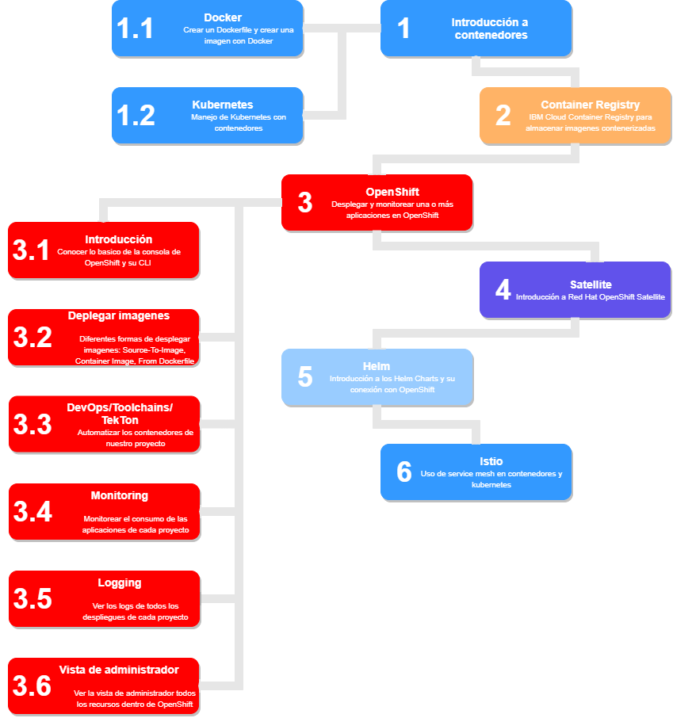

# Pixys Learning Path - Contenerización

---

Bienvenidos al learning path sobre contenedores. A lo largo de este contenido van a ir viendo concepto tanto teóricos como prácticos. este "roadmap" se ha dividido en secciones de duración aproximada de una hora para poder organizar personalemente los tiempos, la idea es que cada sesión complete un tema, o una parte de uno:

---
  

## Indice:

1. **Introducción a contenedores**
    
    1.1. [Docker](pages/1/docker.md#docker)
    
    1.2. [Kubernetes](pages/1/kubernetes.md#kubernetes)

2. [**Container Registry**](pages/2/container_registry.md#container-registry)

3. **OpenShift**
    
    3.1. [Introducción](pages/3/openshift.md#openshift)

    3.2. [Desplegar imagenes](pages/3/3.2/desplegar_imagenes.md#desplegar-imagenes)

    3.3. [DevOps/Toolchain/TekTon](pages/3/3.3/devops.md#devops,-toolchains-&-tekton)

    3.4. [Monitoring](pages/3/3.4/monitoring.md#monitoring)

    3.5. [Logging](pages/3/3.5/logging.md#logging)

    3.6. [Vista de administrador](pages/3/3.6/vista_de_administrador.md#vista-de-administrador)

4. [**Satellite**](pages/4/satellite.md#satellite)

5. [**Helm**](pages/5/helm.md#helm)

6. [**Istio**](pages/6/istio.md#istio)