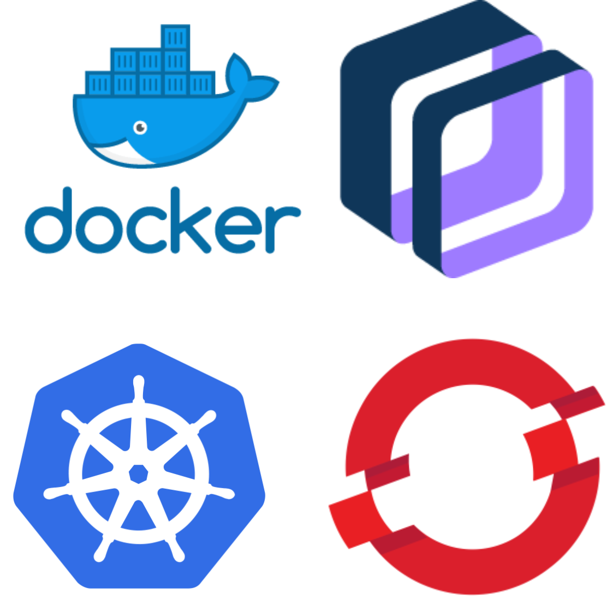
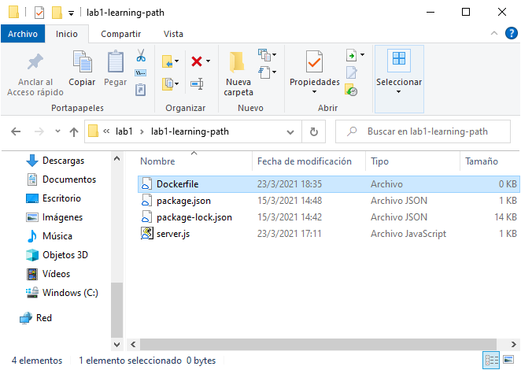
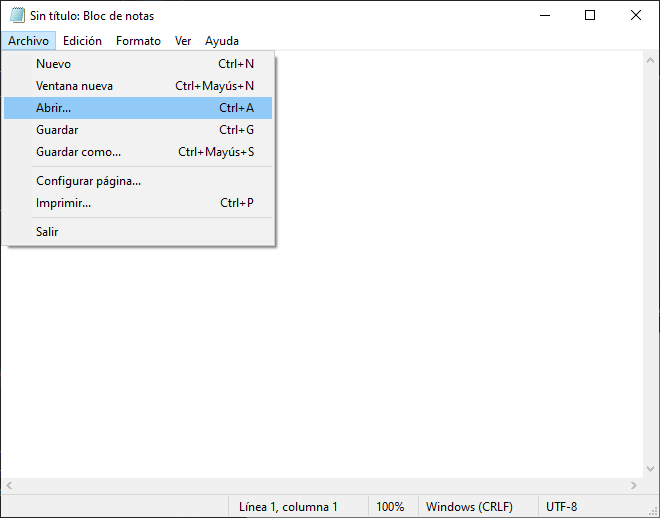
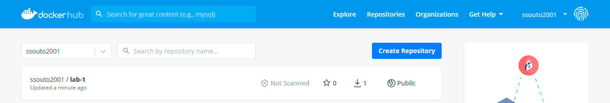

# Docker

<p align="center">
  
</p>

---

### Hablaremos un poco sobre la definición de un contenedor, Docker, DockerHub, Docker images, y cómo crearlas.

* [← Volver al índice](/README.md#indice)
---
  

## *Indice de la sección:*

* ## **Introducción a contenedores**
    
    * ## [Docker](#¿qué-es-un-contenedor?)
        * [¿Qué es un contenedor?](#¿qué-es-un-contenedor?)
        * [¿Qué es Docker?](#¿qué-es-docker?)
        * [DockerHub](#dockerhub)
        * [Container Registry IBM](#container-registry-ibm)
        * [Pongámoslo en práctica](#pongámoslo-en-práctica)
          1. [Crear Dockerfile](#1.-crear-dockerfile)
          2. [Crear imagen](#2.-crear-imagen)
          3. [Crear contenedor](#3.-crear-contenedor)


---

## ¿Qué es un contenedor?

Un contenedor es una unidad de software ejecutable que puede correrse en cualquier lugar. Se virtualiza a nivel del sistema operativo. Es pequeño, rápido y portable. A diferencia de una máquina virtual, no incluye un sistema operativo huésped en cada instancia, sino que aprovecha el sistema operativo hospedador.

Es una estandarización a cómo empaquetamos y entregamos software. Además, habilita una arquitectura de microservicios para mejorar y facilitar escalamiento.

En la siguiente imagen podemos ver la diferencia entre una máquina virtual y un contenedor:

<p align="center">
  
</p>

---

## ¿Qué es Docker?

Docker es una plataforma de software para construir (build) y correr (run) contenedores. Se basa en una comunidad open source. Su uso principal se logra apreciar a través de su interfaz de línea de comando (**CLI**, por sus siglas en inglés). Para que Docker conozca las instrucciones a la hora de hacer el *build* es necesario un archivo que llamaremos Dockerfile (*archivo sin extensión*).

Un **Dockerfile** es una documento de texto (sin extensión) que contiene todos los comandos para crear una imagen. Probablemente exista cierta confunsión en por qué estamos hablando de imagenes y no contenedores. Para establecer una diferenciación entre imagen y contenedor, veamos lo siguiente: 
* Una imagen es un archivo inmutable, de solo lectura, que contiene librerías, dependencias y código fuente.
* Por otro lado, un contenedor es una imagen en ejecución. Para explicarlo con una analogía, si la imagen fuese una clase, el contenedor sería una instancia de la imagen.

Los Dockerfile funcionan por medio de, principalmente, 7 posibles instrucciones:
* **FROM** - Imagen base (p.ej. el lenguaje de programación en que se haya escrito el código).
* **RUN** - Ejecuta comandos.
* **ENV** - Configura las variables de ambiente.
* **ADD** & **COPY** - Copia archivos y directorios.
* **WORKDIR** - Crea directorios para trabajar dentro de la imagen.
* **EXPOSE** - Expone un puerto para nuestra aplicación.
* **CMD** - Define la forma de ejecutar el contenedor (solo se ecribe una instrucción de este tipo).

---

## DockerHub

**Docker Hub** es un servicio provisto por Docker para encontrar y/o compartir imagenes contenerizadas. Cuenta con la posibilidad de crear repositorios tanto públicos como privados y se interactúa también mediante la CLI de Docker.

---

## Container Registry IBM

**Container Registry** es un servicio provisto por ***IBM Cloud*** para almacenar y distribuir imágenes de contenedores en un registro privado y completamente administrado por nosotros, siendo similar a DockerHub. Además, gracias a las herramientas de seguridad de IBM, nuestras imágenes pueden ser revisadas para detectar problemas de seguridad e informarnos de los mismo para que tomemos las precauciones pertinentes. El servicio nos permite almacenar hasta 600 MB de forma gratuita, luego el costo depende del peso de nuestras imágenes. (*Veremos este tema con mayor detalle más adelante*)

---

## **Pongámoslo en práctica**

### Ahora vamos a seguir una serie de pasos para crear una imagen de Docker y subirla a DockerHub, y luego a Container Registry IBM. Para ello vamos a necesitar tener descargados algunos programas (CLI) y además tener una cuenta en [**DockerHub**](https://hub.docker.com/signup) y otra en [**IBM Cloud**](https://cloud.ibm.com/registration).

### Primero lo primero: una vez que tengamos creadas las cuentas de DockerHub e IBM Cloud, pasemos a descargar la CLI tanto de [**Docker**](https://docs.docker.com/get-docker/), como de [**IBM Cloud**](https://cloud.ibm.com/docs/cli?topic=cli-getting-started).
 
### Lo que haremos será crear una imagen a partir de una web app simple en *node.js* que la pueden descargar <a href="../../assets/lab1/lab1-learning-path.zip" download="Lab-1-node-web-app.zip">haciendo click aquí.</a> Una vez extraída la carpeta podremos continuar trabajando en ella.

## 1. Crear Dockerfile

### Primero abrimos una terminal de linea de comando en el directorio de la carpeta extraída, y escribimos lo siguiente para crear el Dockerfile y luego editarlo en cualquier editor de texto, por ejemplo, el bloc de notas:

```console
Windows:
$ type nul >> Dockerfile
Linux:
$ touch Dockerfile
```
Deberiamos ahora, ver en nuestra carpeta el siguiente archivo nuevo:

<p align="center">
  
</p>

Ahora abrimos este archivo desde nuestro editor de texto, en nuestro caso usamos el *bloc de notas*:

<p align="center">
  
  
</p>

Una vez dentro del archivo para editar, empecemos a escribir la instrucciones. La primera será la de la imagen base. Usaremos node en su versión 14 que está disponible como imagen oficial en DockerHub:
```
FROM node:14
```
Luego, creamos un directorio para trabajar en la imagen:
```
WORKDIR /usr/src/app
```
Como node 14 ya tiene npm instalado, solo debemos copiar el archivo package.json:
```
COPY package*.json ./
RUN npm install
```
Ahora queda copiar el código fuente:
```
COPY . .
```
Como en nuestra aplicación establecimos el puerto 8080 para exponerla, debemos especificarlo en el Dockerfile:
```
EXPOSE 8080
```
Para finalizar, debemos indicarle el comando a ejecutar para correr nuestra aplicación:
```
CMD [ "node", "server.js"]
```

Una vez terminado, debería quedarnos algo parecido a lo siguiente:

<p align="center">
  
</p>

¡Genial! Solo falta guardarlo y ya tendríamos nuestro Dockerfile listo.

## 2. Crear imagen

### ¡Ya estamos listos para crear nuestra imagen en Docker! Lo que vamos a hacer es abrir la linea de comandos en el directorio en el que venimos trabajando y seguir los pasos siguientes:

<br>

Para trabajar con imagenes de Docker usaremos los comandos de la CLI que descargamos, es por ello que siempre comenzarán con *docker*. En este caso, para crear una imagen se usa el comando *docker build*, además, hay que agregarle un nombre (*tag*), para eso usamos *-t* seguido del nombre (**es una buena práctica crear el tag con este formato `<usuario>/<nombre>:<versión>`**). Por último, se ve un punto ( **.** ), que especifica la ruta al Dockerfile (como estamos en el mismo directorio que el Dockerfile, se coloca solo un punto):
```console
$ docker build -t <usuario>/lab-1:0.1 .

Resultado:
[+] Building 3.2s (11/11) FINISHED
 => [internal] load build definition from Dockerfile                0.1s
 => => transferring dockerfile: 174B                0.0s
 => [internal] load .dockerignore                0.1s
 => => transferring context: 2B                0.0s
 => [internal] load metadata for docker.io/library/node:14                2.8s
 => [auth] library/node:pull token for registry-1.docker.io                0.0s
 => [1/5] FROM docker.io/library/node:14@sha256:fe84...                   0.0s
 => [internal] load build context                0.0s
 => => transferring context: 15.15kB                0.0s
 => CACHED [2/5] WORKDIR /usr/src/app                0.0s
 => CACHED [3/5] COPY package*.json ./                0.0s
 => CACHED [4/5] RUN npm install                0.0s
 => [5/5] COPY . .                0.1s
 => exporting to image                0.1s
 => => exporting layers                0.0s
 => => writing image sha256:33d8a...                0.0s
 => => naming to docker.io/ssouto2001/lab-1:0.1                0.0s
```

Para confirmar que la imagen se creó correctamente usaremos:
```console
$ docker images

Resultado:
REPOSITORY              TAG       IMAGE ID       CREATED         SIZE
ssouto2001/lab-1        0.1       33d8a398f403   3 minutes ago   945MB
```

## 3. Crear contenedor

Una vez que confirmamos que la imagen se creó correctamente vamos a ejecutar el contenedor de la imagen con *docker run* usando alguna *"flags"* comunes. ***-p*** indica el puerto que va a exponer, y ***-d*** deja al contenedor funcionando en "segundo plano" para que se pueda seguir escribiendo en la consola:
```console
$ docker run -p 8080:8080 -d <usuario>/lab-1:0.1

Resultado:
b276485632547df81361f318fee1f7cf5b8ecbe4d05904a3537e44318c75e1b0
```
Ahora, para confirmar que el contenedor se creó correctamente vamos a consultar lo siguiente:
```console
$ docker ps
CONTAINER ID   IMAGE                 COMMAND                  CREATED         STATUS         PORTS                    NAMES
b27648563254   ssouto2001/lab-1:0.1   "docker-entrypoint.s…"   2 minutes ago   Up 2 minutes   0.0.0.0:8080->8080/tcp   relaxed_chebyshev
```
Con este comando podes conocer el **CONTAINER ID** para revisar sus logs (*al momento de escribir el ID del contenedor, podemos escribir el numero completó o al menos los primeros tres dígitos*):
```console
$ docker logs b27648563254
Resultado:
App listening on port 8080
```
Ahora podemos acceder a http://localhost:8080 y verificar el mensaje correcto.

## 4. Subir la imagen a DockerHub

Es momento de subir nuestra imagen a un repositorio donde podremos configurarlo como público o privado (dependiendo el plan que tengamos) en DockerHub, para ello, debemos tener una [cuenta de DockerHub creada](https://hub.docker.com/signup).

Una vez creada la cuenta, accederemos desde la terminal:
```console
$ docker login
```

Luego, debemos hacer un *tag* (darle nombre en el destino) a nuestra imagen que creamos anteriormente:
```console
$ docker tag <tu-imagen> <usuario-docker>/<nombre-del-repo>
```

Ahora solo queda ejectuar *docker push* para subir la imagen al repositorio:
```console
$ docker push <usuario-docker>/<nombre-del-repo>
```

¡Listo! Podemos verificar que se publicó correctamente la imagen en nuestra cuenta de DockerHub:

<p align="center">
  
</p>


### Con esto finalizamos el lab y sección de Docker. Avancemos a la siguiente sección... **Kubernetes**


---

* [→ Siguiente Sección (Kubernetes)](kubernetes.md#kubernetes)

* [← Volver al índice](/README.md#indice)