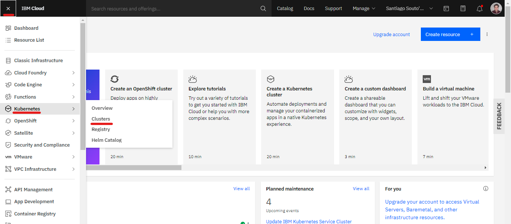
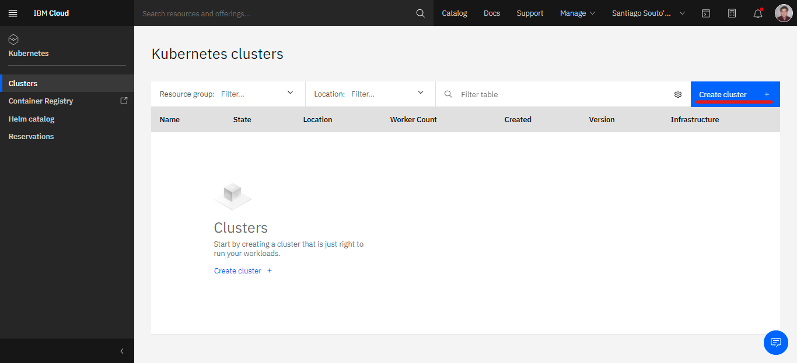
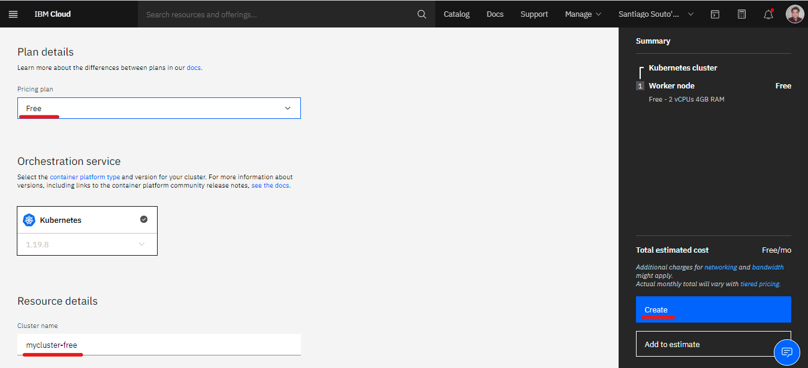
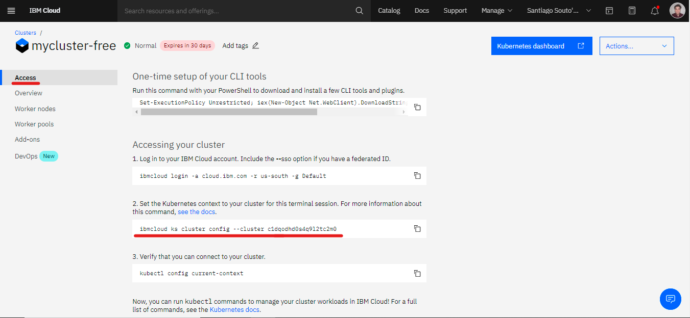

# Kubernetes


---


* [← Volver al índice](/README.md#indice)
---
  

## *Indice de la sección:*

* ## **Introducción a contenedores**
    
    * ## [Kubernetes]()
        * [¿Qué es kubernetes?](#¿qué-es-kubernetes?)
        * [Objetos básicos de Kubernetes](#objetos-básicos-de-kubernetes)
        * [Pongámoslo en práctica](#pongámoslo-en-práctica)
          1. [Crear Kubernetes cluster](#crear-kubernetes-cluster)
          2. [Crear un Deployment](#crear-un-deployment)

---

## ¿Qué es kubernetes?

Kubernetes es una plataforma de orquestación de contenedores. Administra el ciclo de vida de los contenedores, especialmente en entornos grandes y dinámicos, además de servicios que facilitan tanto configuraciones declarativas o automatizadas. Es portable, extensible y *open-source*, con un gran ecosistema creciendo rápidamente.

Dentro de Kubernetes podemos identificar algunos **objetos**. Estos son entidades persistentes que definen un estado esperado para nuestras cargas de trabajo (*workloads*). Para trabajar con ellos, podemos usar la API de Kubernetes, es decir, la interfaz de linea de comando (**kubectl** - CLI). Consisten de dos partes. ***spec*** (estado deseado) y ***status*** (estado actual).

**Espacios de nombres** (*Namespaces*): Es una virtualización de un **cluster** físico, una forma de organizarlo más eficientemente a las cargas de trabajo. Es ideal para proyectos con gran cantidad de usuarios.

**Etiquetas** (*Labels*): Pares llave/valor, no únicas, unidas a los objetos, pues es la manera en la que se los identifica.

---

## Objetos básicos de Kubernetes

* #### **Pod:** Es la unidad más simple en un Kubernetes. Representa los procesos ejeutandose en el cluster. Puede encapsular a uno o múltiples contenedores. Replicar un Pod es equivalente a escalar una aplicación horizontalmente.

* #### **ReplicaSet:** Su función es mantener un grupo de Pods idénticos, es decir, mantener la cantidad deseada de Pods idénticos funcionando en el cluster. Generalmente, se encuentran encapsulados por los Despliegues (*Deployments*).

* #### **Deployment:** Provee actualizaciones para Pods y ReplicaSets. Ejecuta múltiples réplicas de la aplicación. Es apropiado para aplicaciones que no dependen de un almacenamiento persistente (*stateless application*).

* #### **Service:** Separa las definiciones de tareas de los Pods. Los proxy de servicios de Kubernetes envían automáticamente las solicitudes de servicio al Pod correspondiente, sin importar donde se traslada en el cluster, o incluso si está siendo reemplazado.

---

## **Pongámoslo en práctica**

### Teniendo una idea básica de lo que es Kubernetes y sus objetos básicos, vamos a interactuar con el IBM Cloud Kubernetes Service creando un **deployment** de nginx como prueba.

<br>

## 1. Crear Kubernetes cluster

Lo primero que debemos hacer es entrar con nuestra cuenta a [IBM Cloud](https://cloud.ibm.com) y abrir la barra lateral izquierda, en la parte de *Kubernetes* - *Clusters*:

<p align="center">
  
</p>

Luego, cliqueamos en *Crear cluster +*:

<p align="center">
  
</p>

Nos debemos asegurar que seleccionemos el plan **Free**, le ponemos el nombre que querramos y le damos a *Crear*:

<p align="center">
  
</p>

El proceso de creación del cluster demorará unos 10 o 15 minutos, así que seguiremos los el lab y luego volveremos.

## 2. Crear un Deployment

Una forma muy común de crear objetos de Kubernetes es mediante la CLI (*kubectl*) con archivos YAML. Dicha CLI se instala junto con la CLI de [**IBM Cloud**](https://cloud.ibm.com/docs/cli?topic=cli-getting-started) (Si aún no lo tienes instalado sigue el link).

Entonces lo primero que debemos hacer es crear un archivo YAML (en nuestro caso lo podemos llamar *deployment.yaml*) como el siguiente:
```yaml
apiVersion: apps/v1
kind: Deployment
metadata:
  name: nginx-deployment
  labels:
     app: nginx
spec:
  replicas: 3
  selector:
    matchLabels:
      app: nginx
  template:
    metadata:
      labels:
        app: nginx
    spec:
      containers:
      - name: nginx
        image: nginx:1.7.9
        ports:
        - containerPort: 80
```
Lo que vemos arriba puede funcionar como *template* (plantilla) para futuros Deployments, vemos parte por parte:

* `kind` nos especifica que tipo de objeto de Kubernetes estamos creando (Puede ser Pod, ReplicaSet, Service, etc.).
* `metadata.name` especifica el nombre del Despliegue que será creado.
* `spec.replicas` nos dice cuantos Pods idénticos (réplicas) queremos en nuestro Despliegue.
* `spec.selector`es el modo por el cuál el Despliegue encontrará a los Pods, en nuestro caso, haremos coincidir las etiquetas (*labels*) del tipo **app** con el valor **nginx** que especificaremos en la plantilla de los Pods.
* `template` indicará los Pods que se crearan. Como vemos, `template.metadata.labels` tenemos la etiqueta con la que el *selector* encontrará al Pod.
* `template.spec` determinan, en este caso, que el Pod ejecutará un contendor de nombre **nginx**, con la imagen de *DockerHub* **nginx:1.7.9**. 

<br>

Ahora, entraremos a la terminal o línea de comando, situada en el directorio donde guardamos el archivo YAML para conectarnos con IBM Cloud, y luego con el servicio de Kubernetes:

Como mencionabamos previemente, conectemonos primero con nuestra cuenta de IBM Cloud:
```console
$ ibmcloud login
```
Luego de iniciar sesión correctamente, vamos a volver a la pantalla de nuestro cluster de Kubernetes que quedó creándose, en la sección de *Acceso*. Una vez allí, vamos a copiar el paso 2, para conectar, desde la terminal, este cluster creado:

<p align="center">
  
</p>

Entonces, en el caso que muestra la imagen, copiamos el paso dos:
```console
$ ibmcloud ks cluster config --cluster c1dqodhd0s4q9l2tc2m0

Resultado:
OK
La configuración para c1dqodhd0s4q9l2tc2m0 se ha descargado correctamente.

Contexto añadido para c1dqodhd0s4q9l2tc2m0 al archivo kubeconfig actual.
Ahora puede ejecutar los mandatos 'kubectl' contra el clúster. Por ejemplo, ejecute 'kubectl get nodes'.
Si está accediendo al clúster por primera vez, los mandatos 'kubectl' pueden fallar durante unos segundos mientras RBAC se sincroniza.
```

Como vemos al final del resultado, ahora podemos usar el comando *kubectl* para configurar y hacer cambios en nuestro cluster. Con eso dicho, apliquemos el archivo YAML para crear el Despliegue:
```console
$ kubectl apply -f deployment.yaml

Resultado:
deployment.apps/nginx-deployment created
```

El Despliegue quedó correctamente creado, para verificarlo podemos usar el comando *kubectl get*:
```console
$ kubectl get deployments

Resultado:
NAME               READY   UP-TO-DATE   AVAILABLE   AGE
nginx-deployment   3/3     3            3           2m35s
```

¡Ya realizamos nuestro primer despliegue!

Si queremos ver también los Pods que se crearon junto con el despliegue (*recordemos que se deberían crear 3 por la cantidad de réplicas que seteamos*) usamos el mismo comando *kubectl get*:
```console
$ kubectl get pods

Resultado:
NAME                                READY   STATUS    RESTARTS   AGE
nginx-deployment-5d59d67564-b5485   1/1     Running   0          9m35s
nginx-deployment-5d59d67564-qt5zd   1/1     Running   0          9m35s
nginx-deployment-5d59d67564-wmt2w   1/1     Running   0          9m35s
```

Tambien podemos ver especificaciones de los Pods:
```console
$ kubectl describe pod <nombre-pod>

Resultado:
Name:         nginx-deployment-5d59d67564-b5485
Namespace:    default
Priority:     0
Node:         10.131.73.228/10.131.73.228
Start Time:   Wed, 24 Mar 2021 19:25:10 -0300
Labels:       app=nginx
              pod-template-hash=5d59d67564
Annotations:  cni.projectcalico.org/podIP: 172.30.62.15/32
              cni.projectcalico.org/podIPs: 172.30.62.15/32
              kubernetes.io/psp: ibm-privileged-psp
Status:       Running
IP:           172.30.62.15
IPs:
  IP:           172.30.62.15
Controlled By:  ReplicaSet/nginx-deployment-5d59d67564
Containers:
  nginx:
    Container ID:   containerd://3b55a115a4b9b4eb5074846f581f378d7520a83ee9e0a4e8374d00bbc0fa67a7
    Image:          nginx:1.7.9
    Image ID:       sha256:35d28df486f6150fa3174367499d1eb01f22f5a410afe4b9581ac0e0e58b3eaf
    Port:           80/TCP
    Host Port:      0/TCP
    State:          Running
      Started:      Wed, 24 Mar 2021 19:25:19 -0300
    Ready:          True
    Restart Count:  0
    Environment:    <none>
    Mounts:
      /var/run/secrets/kubernetes.io/serviceaccount from default-token-nzhzj (ro)
Conditions:
  Type              Status
  Initialized       True
  Ready             True
  ContainersReady   True
  PodScheduled      True
Volumes:
  default-token-nzhzj:
    Type:        Secret (a volume populated by a Secret)
    SecretName:  default-token-nzhzj
    Optional:    false
QoS Class:       BestEffort
Node-Selectors:  <none>
Tolerations:     node.kubernetes.io/not-ready:NoExecute for 600s
                 node.kubernetes.io/unreachable:NoExecute for 600s
Events:
  Type    Reason     Age   From               Message
  ----    ------     ----  ----               -------
  Normal  Scheduled  13m   default-scheduler  Successfully assigned default/nginx-deployment-5d59d67564-b5485 to 10.131.73.228
  Normal  Pulling    13m   kubelet            Pulling image "nginx:1.7.9"
  Normal  Pulled     13m   kubelet            Successfully pulled image "nginx:1.7.9" in 7.438932697s
  Normal  Created    13m   kubelet            Created container nginx
  Normal  Started    13m   kubelet            Started container nginx
```

Además de esto, podemos entrar al *dashboard* de Kubernetes desde IBM Cloud. ¡Invitamos a que exploren esa área!

### Con esto finalizamos el lab y sección de Kubernetes, además de la primera lección de *Introducción a contenedores*. Avancemos a la siguiente sección... **Container Registry**


---

* [→ Siguiente Sección (Container Registry)](../2/container_registry.md#container-registry)

* [← Volver al índice](/README.md#indice)