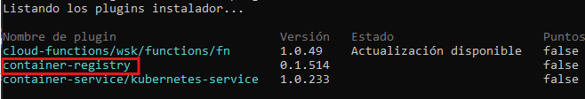

# Container Registry


---


* [← Volver al índice](/README.md#indice)
---
  

## *Indice de la sección:*

* ## **Container Registry**
    
    * [¿Qué es un *Container Repository*?](#¿qué-es-un-container-repository?)
    * [¿Qué es un *Container Registry*?](#¿qué-es-un-container-registry?)
    * [IBM Cloud Container Registry Service](#ibm-cloud-container-registry-service)
    * [Pongámoslo en práctica](#pongámoslo-en-práctica)
      1. [Conectarnos con IBM Cloud CLI y el plugin container-registry](#1-conectarnos-con-ibm-cloud-cli-y-el-plugin-container-registry)
      2. [Crear un *namespace*](#2-crear-un-namespace)
      3. [Conectar **Docker** con **IBM Cloud Container Registry**](#3-conectar-docker-con-ibm-cloud-container-registry)
      4. [Subir la imagen](#4-subir-la-imagen)
    

---

## ¿Qué es un *Container Repository*?

El Container Repository o repositorio de imagenes es usado para almacenar distintas versiones de una imagen contenerizada (*container image*) para distribución y despliegue. Podemos hacer *push* o *pull* de imagenes hacia o desde un repositorio.

---

## ¿Qué es un *Container Registry*?

Es un servicio que proporciona una colección de repositorios en donde podemos almacenar imagenes. Pueden ser alojados de forma pública o privada.

**IBM Cloud Container Registry Service** proporciona un registro de imagenes (*image registry*) **privado**, **altamente disponible**, **escalable**, **encriptado** y **multi-tenant** que es alojado y administrado por IBM. Podemos empezar a usar el IBM Cloud Container Registry con sola configurar nuestro propio espacio de nombre (*namespace*) y haciendo *push* a una imagen contenerizada a dicho espacio.

---

## IBM Cloud Container Registry Service

Una imagen de Docker es la base para todo contenedor que es creado. Generalmente, las imagenes se almacenan en registros que pueden accederse de manera pública (*public regitry*) o configurado para el acceso de un grupo limitado de usuarios (*private registry*).

Con IBM Cloud Container Registry, solo aquellos usuarios que tengan acceso a nuestra cuenta de IBM Cloud podrán acceder a nuestras imagenes. Además, cuando hacemos un *push* de nuestras imagenes hacia IBM Cloud Container Registry, tenemos el beneficio de contar con las funciones integradas de *Vulnerability Advisor* que busca potenciales problemas de seguridad y vulnerabilidad.

### Propiedades de IBM Cloud Container Registry:

* **Registro privado altamente disponible y escalable**
    * Podemos hacer *push* a imagenes privadas para luego ejecutarlas en otros servicios o ambientes de IBM Cloud, como puede ser **IBM CLoud Kubernetes Service** (que lo vimos en la sección anterior), **Red Hat OpenShift Kubernetes Service** (que lo veremos en la siguiente sección) entre otros.
    * Las imagenes son chequeadas por pontenciales problemas de seguridad regularmente para tener control total y podamos tomar decisiones informadas acerca de nuestros despliegues.

* **Cumplimiento de seguridad de imagen con *Vulnerability Advisor***
    * Escaneos automáticos a las imagenes dentro de nuestros espacios de nombre.
    * Podremos evaluar recomendaciones para corregir potenciales vulnerabilidades y proteger nuestros contenedores de estar comprometidos.

* **Quota limite para almacenamiento y *pull traffic***
    * Nos podemos beneficiar de una cantidad de espacio gratis (*free quota*) para almacenamiento y *pull traffic* de nuestras imagenes privadas.
    * Podemos tambien configurar los limites de quota por mes para evitar excederse de los niveles de pagos preferidos.

IBM Cloud Container Registry expone una REST API para administrar todas las funciones del registro, incluyendo especios de nombre, imagenes, reportes de vulnerabilidades, quotas y control de acceso. Esta API puede ser totalmente controlada por la IBM Cloud CLI (*usada en secciones anteriores*) o controlada con funcionalidades básicas en el UI de IBM Cloud.

---

## Pongámoslo en práctica

### Ahora que ya vimos bastante de teoría, junto con lo realizado en los labs de secciones anteriores, vamos a subir nuestra imagen que tenemos en Docker al IBM Cloud Container Registry.

<br>

## 1. Conectarnos con IBM Cloud CLI y el plugin container-registry

Lo primero que debemos hacer es asegurarnos que, dentro de la CLI de IBM Cloud que ya usamos previamente, tengamos instalado el plugin para administrar nuestros servicio de Container Registry. Para ello vamos a listar los plugins instalados actualmente:
```console
$ ibmcloud plugin list
```
Debería aparecer el siguiente cuadro (*container-registry*)
<p align="center">
  
</p>

En caso que no este instalado, usaremos el comando de *install* y en caso contrario, el comando de *update*:

* comando *install*:
    ```console
    $ ibmcloud plugin install container-registry
    ```
* comando *update*:
    ```console
    $ ibmcloud plugin update container-registry
    ```

Una vez completado, iniciamos sesión en IMB Cloud desde la CLI como en la sección anterior:
```console
$ ibmcloud login
```

## 2. Crear un *namespace*

Ahora que estamos dentro de IBM Cloud, y tenemos el plugin de container registry instalado, podemos empezar a usar el servicio, que, como vimos en la parte teórica de esta sección, se logra creando un primer nombre de espacio (*namespace*):
```console
$ ibmcloud cr namespace-add <nombre-del-namespace>
```

> **Nota:** Los *namespaces* o espacios de nombre son unicos dentro de una misma región. Es decir que podemos usar el mismo nombre de *namespace* en cada región, siempre y cuando en dicha región ningún otrousuario haya creado un *namespace* con ese nombre.

Podemos verificar que se creó correctamente listando todos los espacios de nombre:
```console
$ ibmcloud cr namespaces
```

## 3. Conectar **Docker** con **IBM Cloud Container Registry**

Lo que haremos será conectar el daemon de Docker con el Container Registry de IBM Cloud para poder subir la imagen desde Docker, directo a nuestro nuevo *namespace* recientemente creado (recordar que debemos estar logueados en Docker con `$ docker login`):
```console
$ ibmcloud cr login

Iniciando sesión en 'registry.ng.bluemix.net'...
Se ha iniciado sesión en 'registry.ng.bluemix.net'.
Iniciando sesión en 'us.icr.io'...
Se ha iniciado sesión en 'us.icr.io'.

OK
```

## 4. Subir la imagen

Para esta parte usaremos la imagen que subimos en la sección de Docker (`<usuario>/lab-1:0.1`), en caso de no recordarla, podemos usar el comando `$ docker images` que nos listará todas las imagenes que tenemos creadas con su versión correspondiente.

Entonces, lo que haremos primero es indicar el namespace y repositorio en los que vamos a subir la imagen en Container Registry (para que Docker identifique a Container Registry usaremos la dirección identificadora de IBM Container Registry - `*us.icr.io*`):
```console
$ docker tag <usuario>/lab-1:0.1 us.icr.io/<nombre-del-namespace>/<nombre-del-repo>:<versión>
```
> **Nota:** Recordar que `<nombre-del-namespace>` es el mismo con el que creamos el *namespace* en el paso 2 y `<nombre-del-repo>` es el nombre que le querramos dar a nuestro nuevo repositorio en caso de no tener uno dentro de dicho *namespace*.

Ahora subamos la imagen al registro:
```console
$ docker push us.icr.io/<nombre-del-namespace>/<nombre-del-repo>:<versión>
```

Podemos verificar que se subió correctamente con el siguiente comando:
```console
$ ibmcloud cr image-list
```

### Con esto finalizamos el lab y lección de Container Registry. Avancemos a la siguiente lección... **OpenShift**


---

* [→ Siguiente Sección (OpenShift)](../3/openshift.md#openshift)

* [← Volver al índice](/README.md#indice)