# Desplegar imagenes

---

* [← Volver al índice](/README.md#indice)
---
  

## *Indice de la sección:*

* ## **Desplegar imagenes**
    
    * [From Git](#from-git)
        * [Pongámoslo en práctica (From Git)](#pongámoslo-en-práctica-from-git)
    * [From Dockerfile](#from-dockerfile)
        * [Pongámoslo en práctica (From Dockerfile)](#pongámoslo-en-práctica-from-dockerfile)
    * [From Catalog](#from-catalog)
        * [Pongámoslo en práctica (From Catalog)](#pongámoslo-en-práctica-from-catalog)
    * [Container Registry](#container-registry)
        * [Pongámoslo en práctica (Container Registry)](#pongámoslo-en-práctica-container-registry)
    

---

### La idea de esta sección es visualizar las diferentes formas que nos ofrece OpenShift de desplegar imagenes en nuestro cluster, y visualizar cómo con pocos clicks, podemos tener desplegada, por ejemplo, una web app.

### Algunas de las formas que existen de crear o desplegar aplicaciones son:
### → From Git
### → From Dockerfile
### → From Catalog
### → Container image

### Las veremos más en detalle a cada una de estas junto con una parte práctica (*Lab*) al final. Comenzaremos con la forma conocida como Source-To-Image, es decir, dando el código fuente, OpenShift se encarga de crear la imagen, el despliegue y el servicio. Para las partes prácticas usaremos la misma aplicación que usamos en la sección de [Docker](/pages/1/docker.md).

---

## From Git

Lo que hace esta opción es tomar una aplicación en un repositorio de GitHub (*source code*) y se le asigna una *image-builder* según el lenguaje usado. Básicamente, una *image-builder* es un *template* que crea automáticamente una imagen, un despliegue, un servicio y una ruta sobre un código fuente sin necesidad de, por ejemplo, un *Dockerfile*.

### Pongámoslo en práctica (From Git)

En la sección anterior vimos que cuando entramos al *dashboard* de nuestro *cluster* nos aparece lo siguiente:

  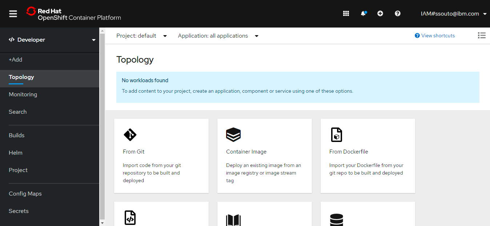

Aseguramonos que estamos en el área de **Developer** (*esquina superior izquierda*) y en la sección de **Topology** (*barra lateral izquierda, debajo de Developer y +Add*). Allí veremos los despliegues que tengamos en el proyecto seleccionado; para seleccionar, cambiar o crear proyectos, debemos hacerlo desde el menú desplegable que dice **Projects** (*al lado de la barra lateral izquierda y el área de Developer*).

La sección de **Topology** nos mostrará todos los despliegues, servicios, imagenes, etc. que tengamos en nuestro proyecto, como aún no hemos creado nada, la sección de **Topology** es igual a la sección de **+Add** (*la cual usaremos luego de esta práctica*).

Entonces, para empezar, cliquearemos en la opción de *From Git* para desplegar nuestra primer imagen desde un repositorio de GitHub.

  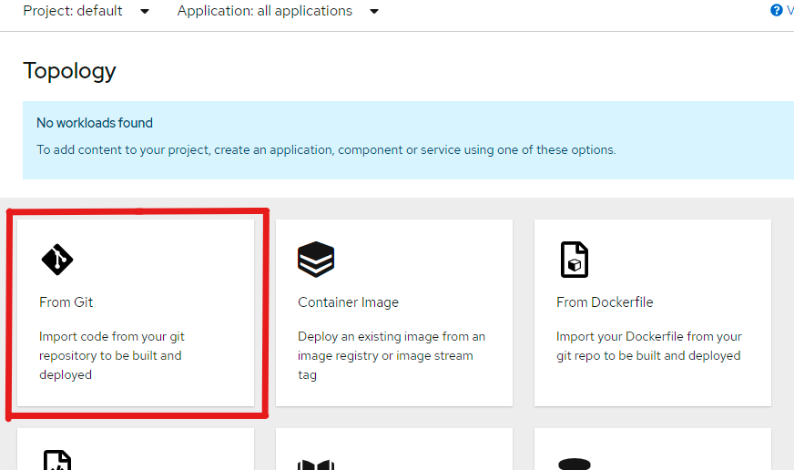

Esta es la sección de configuración:

  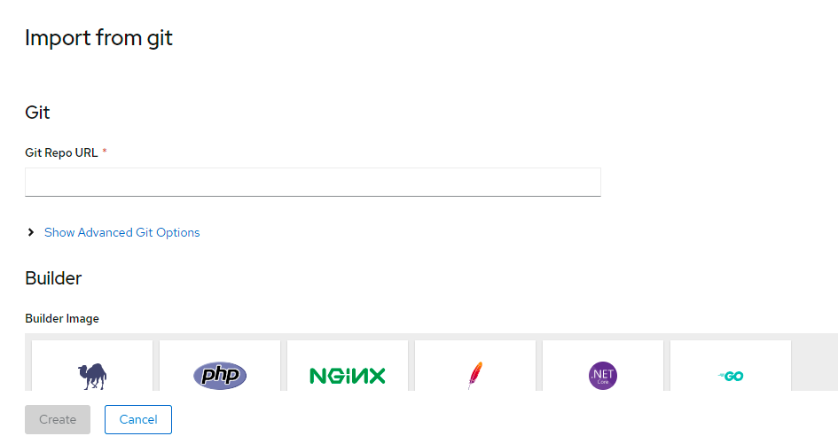

Donde nos dice **Git Repo URL \*** pegamos el URL del repositorio de GitHub donde tenemos la aplicación, en nuestro caso es https://github.com/IBMInnovationLabUY/pyxis-ocp. Puede suceder que nuestra aplicación esté en un sub-directorio del repositorio, para indicarlo, cliquearemos en *> Show Advanced Git Options*, y escribiremos la ruta del directorio en la parte de **Context Dir**, en nuestro caso es ***assets/lab2/***

  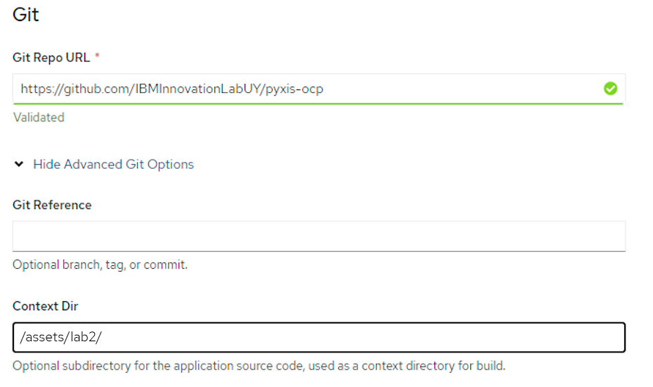

Una vez listo ello, nos deberá confirmar que el URL es válido y podremos seguir con la selección del *Builder*, que es donde especificamos el lenguaje del código que tenemos en el repositorio, generalmente, como en este caso, el lenguaje se identifica automáticamente:

  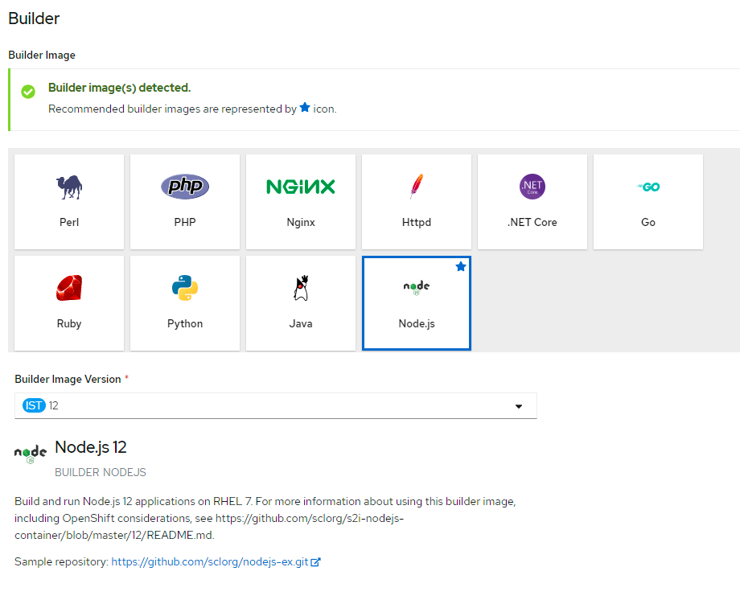

Luego nos escribe automáticamente el nombre de la imagen y de la aplicación (*lo podemos cambiar si queremos*), además de confirmar que queremos que queremos generar un *Deployment* y un URL público para visualizar nuestra aplicación. Una vez que veamos todo eso, le damos a *Crear*:

  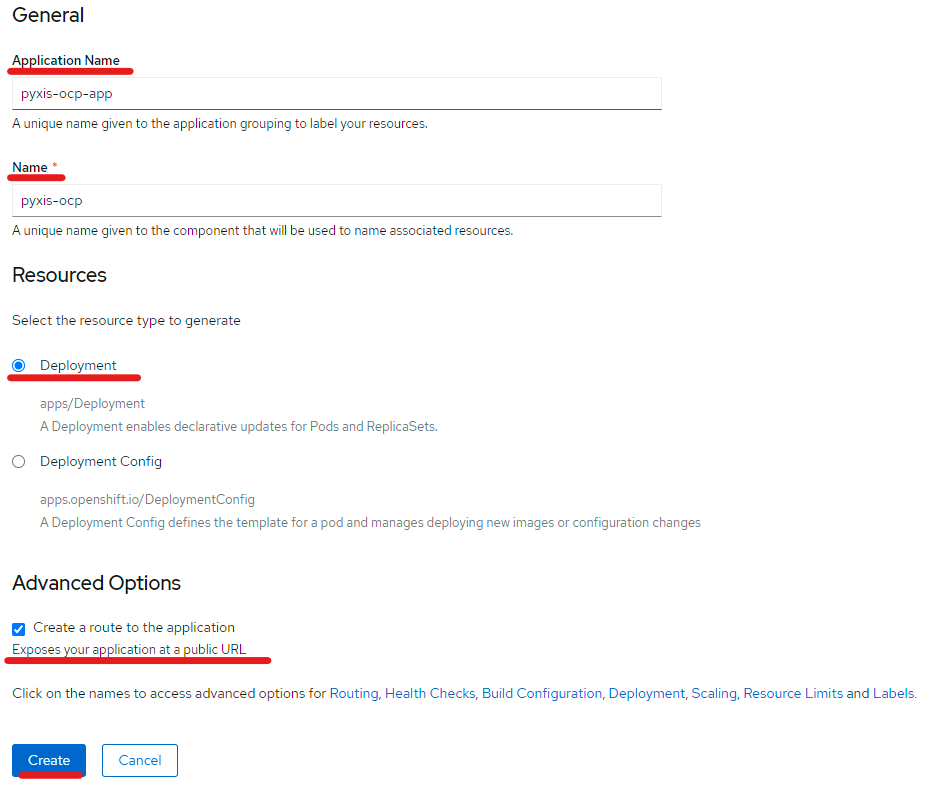

Una vez creado podremos observar que la sección de **Topology** cambió:

  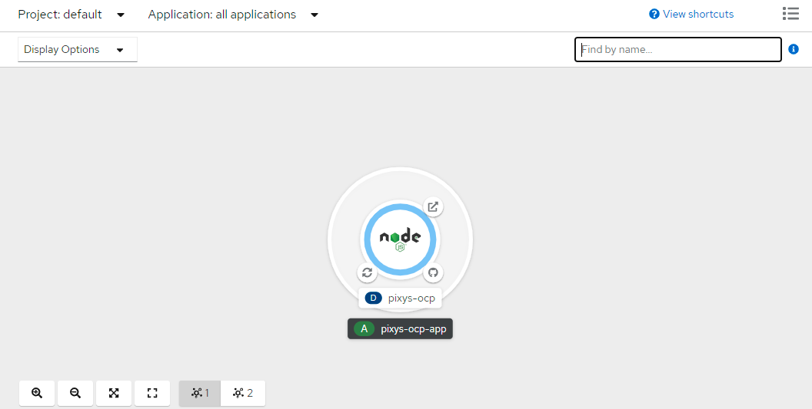

Vemos que el despliegue tiene un anillo celeste, eso significa que esta creando la imagen, una vez listo, pasará a ser un anillo azúl:

  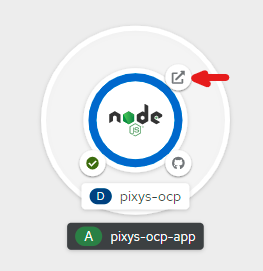

Ahora podemos presionar en el botón superior derecho para que nos redireccione a la URL pública creada automáticamente y veremos la página desplegada:

  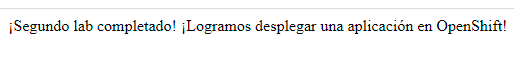

---

## From Dockerfile

Desde una URL a un repositorio git con el código fuente (*source code*) y un archivo *Dockerfile*, indicándole el path de este dentro del repositorio y el puerto que expone, OpenShift nos crear una imagen, despliegue y servicio automáticamente de la misma manera que se hizo en las primeras lecciones.

### Pongámoslo en práctica (From Dockerfile)

Ahora la sección de **Topology** nos muestra todos los despliegues, servicios, imagenes, etc. que tengamos en nuestro proyecto, por lo que tendremos que usar la sección de **+Add** para seguir con esta parte práctica.

Una vez allí, cliquearemos en la opción de *From Dockerfile* para desplegar nuestra segunda imagen desde un repositorio de GitHub, excepto que esta vez tendrá además un archivo *Dockerfile*.

  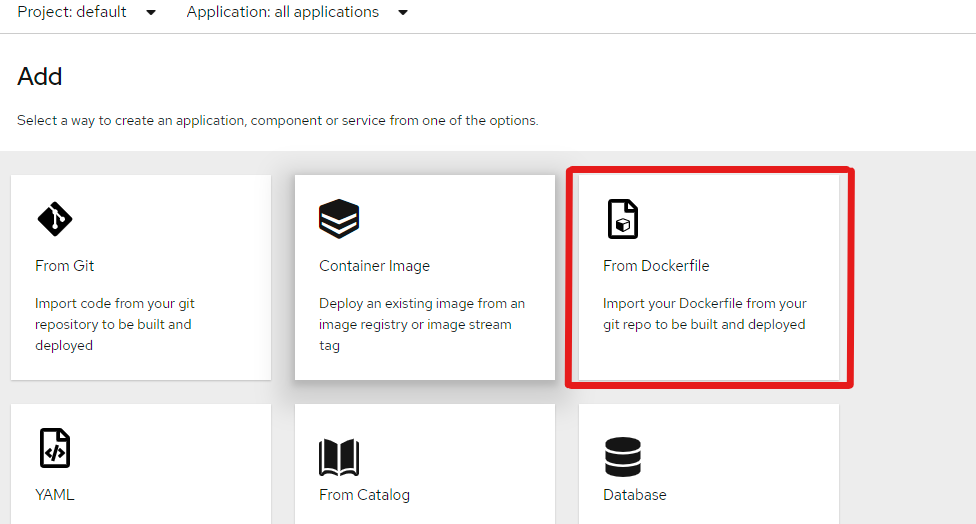

Esta es la sección de configuración:

  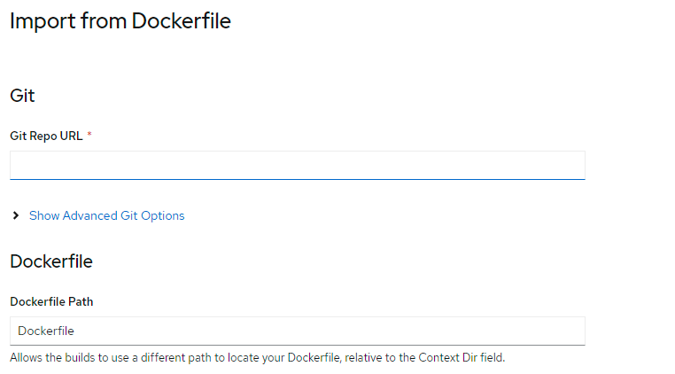

Como se puede ver, es muy parecida a la de *From Git*. Nuevamente, donde nos dice **Git Repo URL \*** pegamos el URL del repositorio de GitHub donde tenemos la aplicación, en nuestro caso es https://github.com/IBMInnovationLabUY/pyxis-ocp. Para indicar el sub-directorio donde está ubicado el código fuente, cliquearemos en *> Show Advanced Git Options*, y escribiremos la ruta del directorio en la parte de **Context Dir**, en nuestro caso es ***assets/lab3/***

  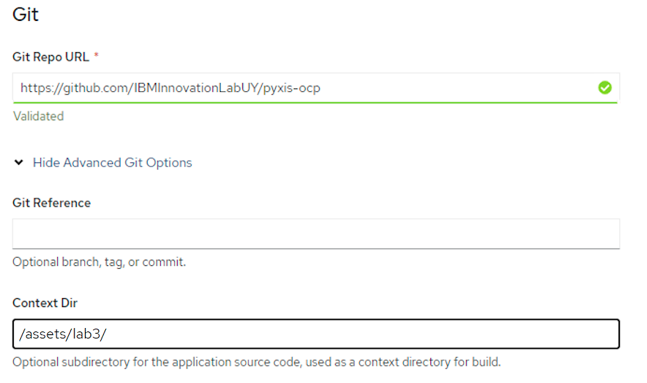

Una vez listo ello, nos deberá confirmar que el URL es válido y podremos seguir con la dirección del *Dockerfile* según el *Context Dir* que indicamos, es decir que, si el archivo esta dentro del directorio que indicamos en **Context Dir**, simplemente escribiremos el nombre del archivo (*que este será nuestro caso*), y en caso de estar en un directorio más "afuera" o "adentro", se deberá especificar. Además, debemos escribir el puerto que expone el *Dockerfile* (si expone uno), en nuestro caso será el **8080**:

  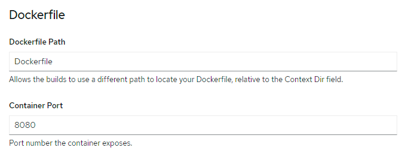

Luego nos escribe automáticamente el nombre de la imagen y de la aplicación (*lo podemos cambiar si queremos, nosotros vamos a dejar todos los despliegues en la "misma aplicación"*), además de confirmar que queremos que queremos generar un *Deployment* y un URL público para visualizar nuestra aplicación. Una vez que veamos todo eso, le damos a *Crear*:

  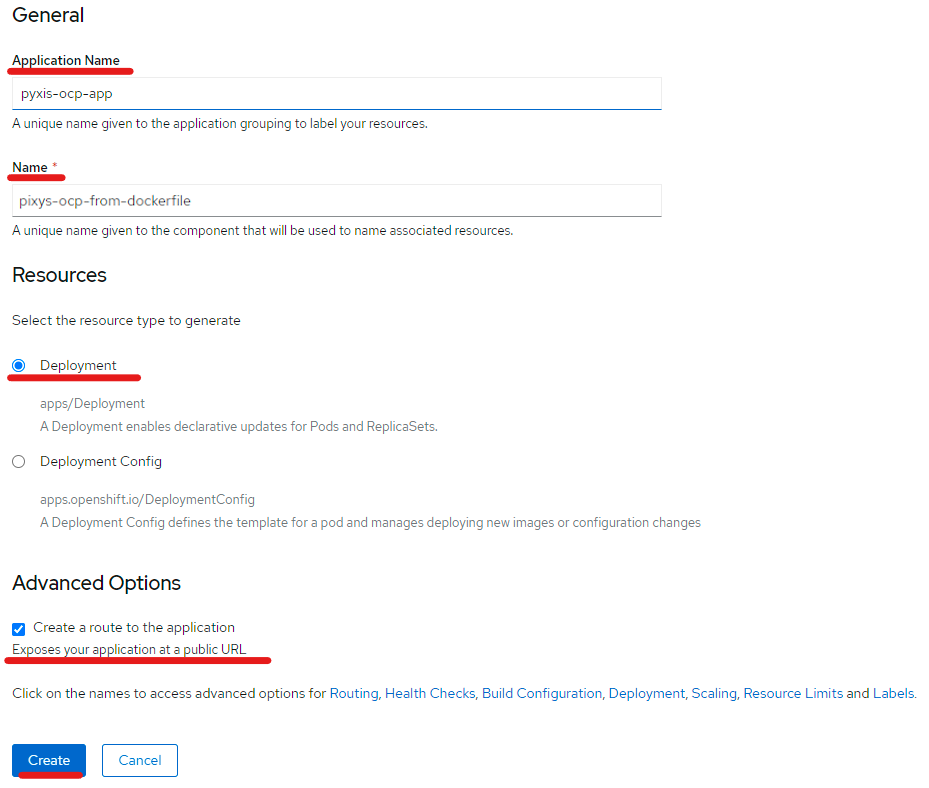

Una vez creado podremos observar que la sección de **Topology** cambió nuevamente, y que ambos despliegues estan encerrados en la "misma aplicación" que funciona como un estilo de etiquetado:

  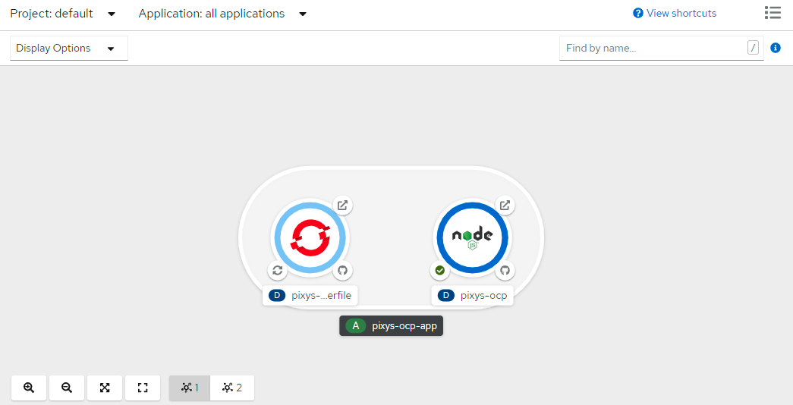

Esperamos a que termine de crear la imagen y una vez listo, pasará a tener un anillo azúl igual que la anterior imagen desplegada:

  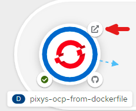

Ahora podemos presionar en el botón superior derecho para que nos redireccione a la URL pública creada automáticamente y veremos la página desplegada:

  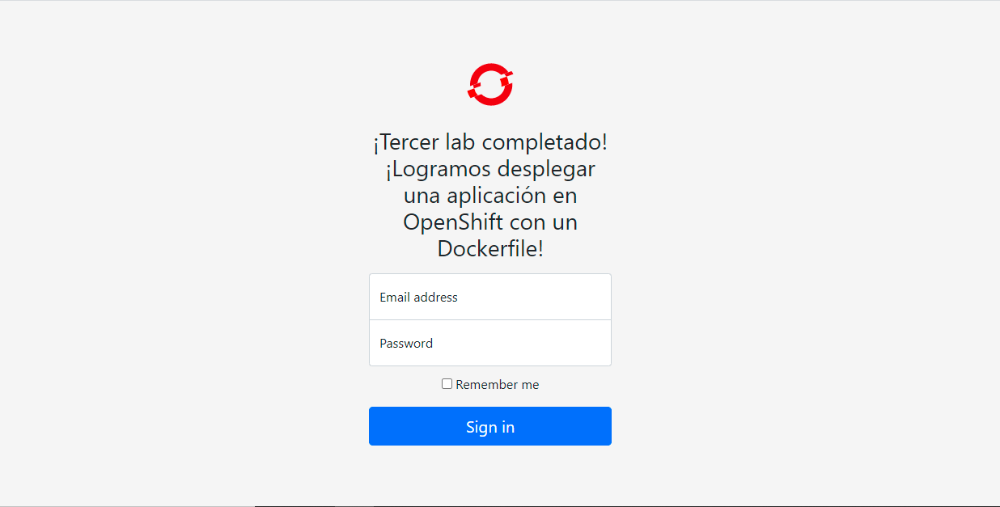

---

## From Catalog

Lo que hacemos en esta opción es elegir desde el catálogo una *Builder Image* y luego se pega el URL del repositorio de GitHub que contenga el código fuente (*source code*). **Es muy similar a la opción *From Git***.

### Pongámoslo en práctica (From Catalog)

Nuevamente (y de aquí en más) tendremos que usar la sección de **+Add** para seguir con esta parte práctica.

Una vez allí, cliquearemos en la opción de *From Catalog* para desplegar nuestra tercer imagen desde un repositorio de GitHub.

  

Esta es la sección de configuración:

  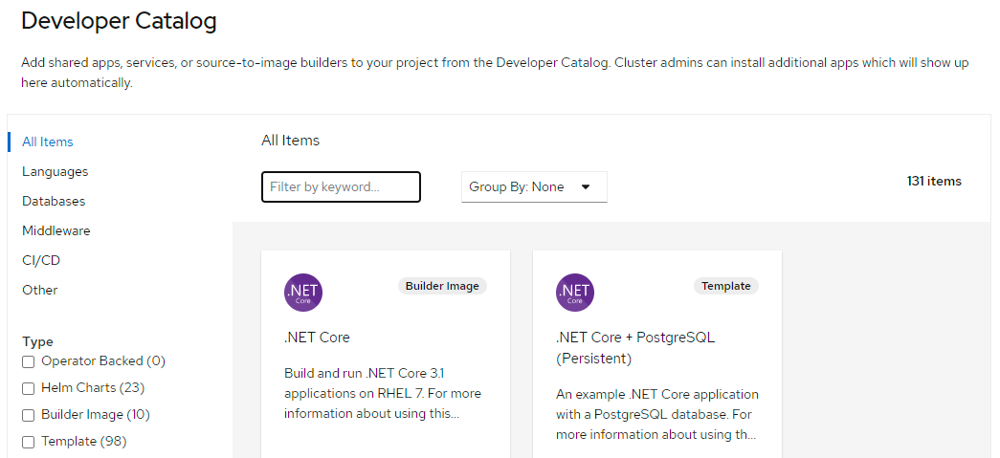

Esta vez, no es nada parecida a la de *From Git* o *From Dockerfile*. Primero tenemos que elegir la *Builder Image*, para ello, en los filtros de la izquierda seleccionamos **Languages** y donde podemos buscar (*Filter by keyword*) escribimos ***node*** y elegimos la que tenga de etiqueta **Builder Image**:

  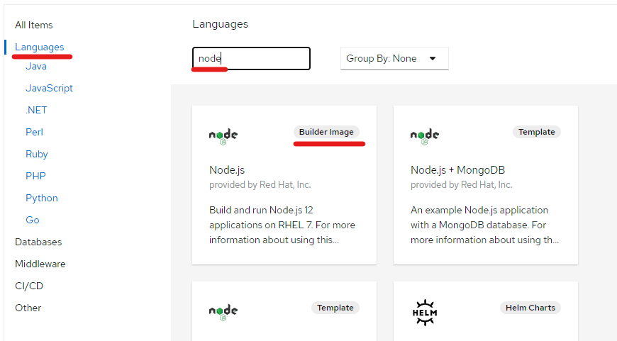

Y cliqueamos en *Crear Aplicación*:

  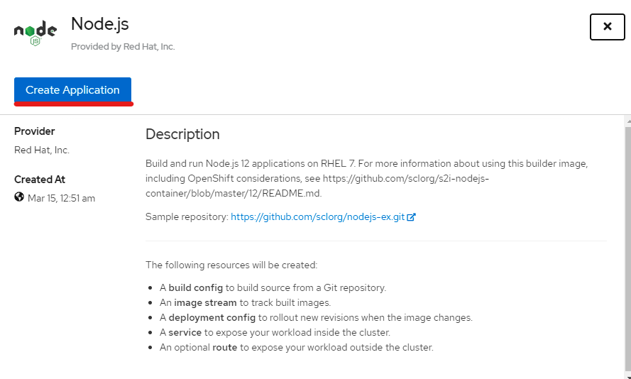

Se nos desplegará un menú parecido a esto:

  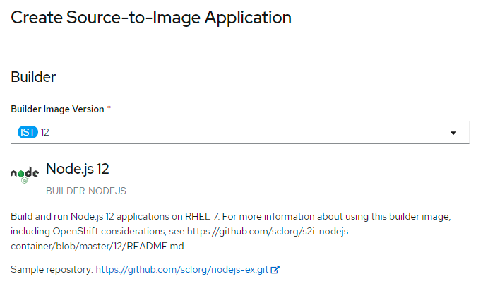

Esta vez, no vamos a usar un repositorio nuestro, sino que usaremos la opción de *Try sample* que nos dará un URL a un repositorio de prueba que servirá para esta muestra:

  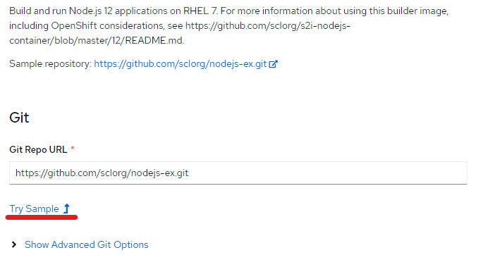

Luego, como ya hemos visto antes, nos escribe automáticamente el nombre de la imagen y de la aplicación (*lo podemos cambiar si queremos, nosotros volvemos a dejar todos los despliegues en la "misma aplicación"*), además de confirmar que queremos que queremos generar un *Deployment* y un URL público para visualizar nuestra aplicación. Una vez que veamos todo eso, le damos a *Crear*:

  

Una vez creado podremos observar que la sección de **Topology** cambió nuevamente, y que los tres despliegues estan encerrados en la "misma aplicación":

  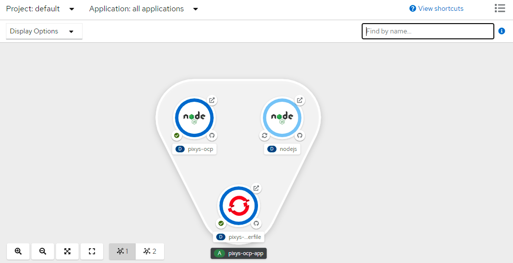

Esperamos a que termine de crear la imagen y una vez listo, pasará a tener un anillo azúl igual que las anteriores imagenes desplegadas:

  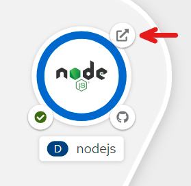

Ahora podemos presionar en el botón superior derecho para que nos redireccione a la URL pública creada automáticamente y veremos la página desplegada:

  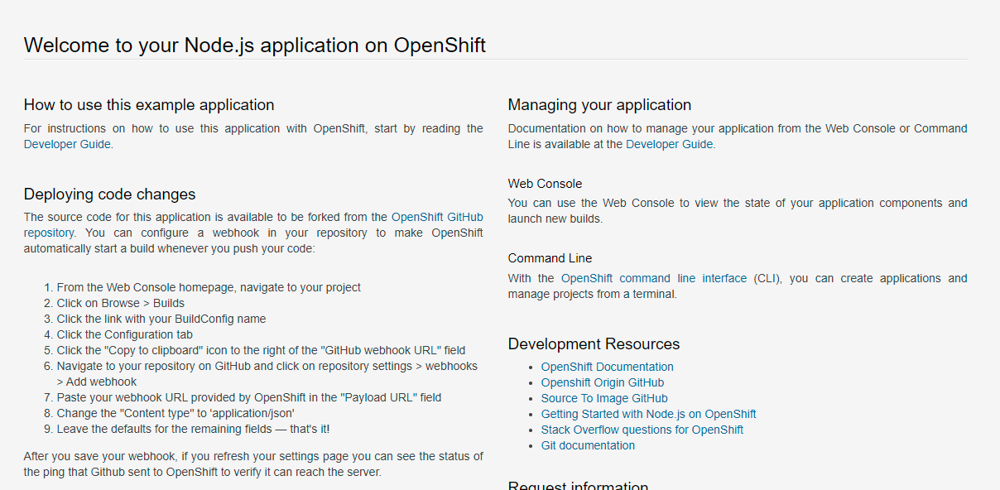

---

## Container Registry

Lo que hace esta opción es tomar una imagen existente desplegada en un registro de imagenes (*image-registry*) o en el mismo proyecto y crea un despliegue y servicio. Cabe explicitar, que las tres opciones anteriores eran parte del método conocido *Source-To-Image* como dijimos al comienzo. En esos casos, OpenShift utiliza un registro de imagenes (*image regitry*) interno para almacenar las imagenes creadas. Es por ello que este método que estamos viendo ahora, no se considera *Source-To-Image*, pues las imagenes ya estan almacenadas en un registro externo, y se obtienen de allí mismo.

### Pongámoslo en práctica (Container Registry)

Primero iremos a la sección **+Add** para seleccionar la opción deseada de esta práctica.

Una vez allí, cliquearemos en la opción de *Container Registry* para desplegar nuestra cuarta y última imagen de esta sección desde un registro de imagenes externo:

  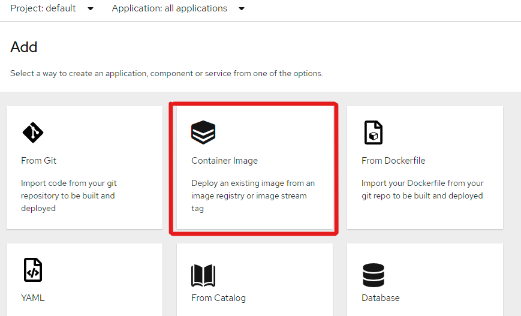

Esta es la sección de configuración:

  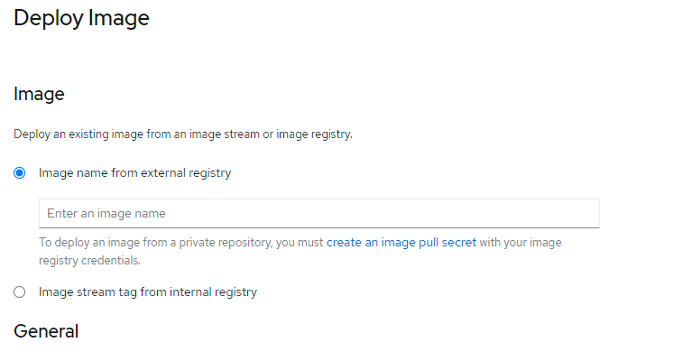

Como se puede ver, esta sección de configuración es más sencilla que las anteriores, solamente hay que seleccionar de qué registro vamos a traer nuestra imagen (si de uno externo o de un *Image Stream Tag* dentro de nuestro proyecto de OpenShift *-veremos más en profundidad los diferentes elementos que podemos encontrar en nuestro proyecto de OpenShift más adelante-*), en nuestro caso, será desde el *IBM Cloud Container Registry* en el cual desplegamos una imagen en la lección de **Container Registry** (Recordemos que podemos consultar nuestras imagenes subidas desde la CLI con el comando `$ ibmcloud cr image-list`):

  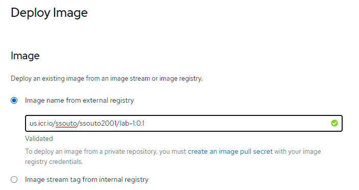

Una vez listo ello, nos deberá confirmar que el URL es válido y ya prácticamente habríamos terminado.

Luego, como ya hemos visto antes, nos escribe automáticamente el nombre de la imagen y de la aplicación (*lo podemos cambiar si queremos, nosotros como anteriormente no lo cambiaremospara que todos los despliegues queden en la "misma aplicación"*), además de confirmar que queremos que queremos generar un *Deployment* y un URL público para visualizar nuestra aplicación. Una vez que veamos todo eso, le damos a *Crear*:

  

Una vez creado podremos observar que la sección de **Topology** nuevamente ha cambiado, y los cuatro despliegues estan encerrados en la "misma aplicación":

  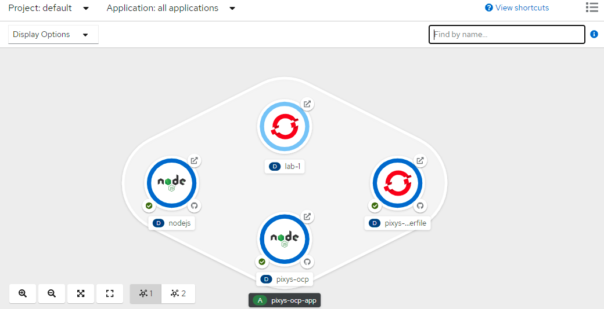

Esperamos a que termine de crear la imagen y una vez listo, pasará a tener un anillo azúl igual que las imagenes anteriormente desplegadas:

  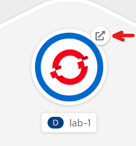

Ahora podemos presionar en el botón superior derecho para que nos redireccione a la URL pública creada automáticamente y veremos el mensaje (*Dirá "¡Primer lab..." pues es la misma imagen que usamos para nuestro primer laboratorio*):

  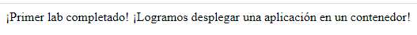

---

### Con esto finalizamos la sección de desplegar imagenes. Avancemos a la siguiente sección... **Devops, Toolchains & TekTon**

---

* [→ Siguiente Sección (DevOps/Toolchains/TekTon)](../3.3/devops.md#devops,-toolchains-&-tekton)

* [← Volver al índice](/README.md#indice)