# DevOps, Toolchains & TekTon

---

* [← Volver al índice](/README.md)
---
  

## *Indice de la sección:*

* ## **Devops, Toolchains & TekTon**
    
    * [Introducción a DevOps](#introducción-a-devops)
    * [IBM Cloud Toolchain](#ibm-cloud-toolchain)
        * [Pongámoslo en práctica](#pongámoslo-en-práctica)
    * [TekTon en IBM Cloud Toolchain](#tekton-en-ibm-cloud-toolchain)
        * [Pongámoslo en práctica](#pongámoslo-en-práctica-tekton)
    
---

## Introducción a DevOps

Cuando hablamos de DevOps, nos referimos a una forma que encontraron los desarrolladores de software para automatizar ciertos procesos rutinarios. Como ya lo mencionamos en secciones anteriores, gracias a DevOps podremos olvidarnos de todos los tediosos pasos de crear una imagen de Docker, subirla a un repositorio, desplegarla en Kubernetes, o desplegarla en OpenShift cada vez que hacemos un cambio en nuestro código; sino que simplemente, subiendo nuestro código fuente a un repositorio Git, tendremos todos estos pasos asegurados sin preocuparnos por hacerlos nosotros, pudiendo ver y pausar en cualquier momento dicha automatización por si notamos un error o queremos ver los logs de estos procesos.

DevOps en sí, cuenta con algunos principios que estaría bueno conocer:

* Desarrollar y testear frente a sistemas similares a producción.
* Desplegar con procesos confiables y repetibles.
* Monitorear y validar operaciones de calidad.
* Amplificar el ciclo de retroalimentación.

  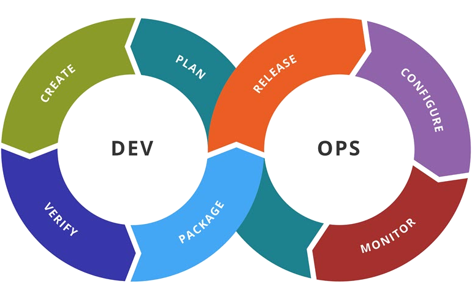

Para explicar y ver el funcionamiento de DevOps, veremos el servicio que ofrece IBM Cloud llamado *Continuous Delivery*, más específicamente, **Toolchain**. Dentro de ello, tendremos diferentes opciones, como por ejemplo, desplegar en OpenShift con o sin TekTon.

---

## IBM Cloud Toolchain

Una *Toolchain* es un conjunto de herramientas integradas que apoyan tareas de desarrollo, despliegue y operaciones. Una opción para crear una *toolchain* es a través de un template o plantilla, en donde, generalmente tendremos nuestro código en un repositorio Git de donde revisará cambios en el código y luego, por ejemplo, crear una imagen y desplegarla en OpenShift. Veremos estos procedimientos de forma práctica en formato Lab.

## Pongámoslo en práctica

### Lo que vamos a crear en este Lab será una *Toolchain* que despliegue una app de Node.js desde un repositorio de GitHub a un proyecto de OpenShift

Primero, desde el dashboard de IBM Cloud, en la barra lateral, entraremos en la pestaña de **DevOps**:

  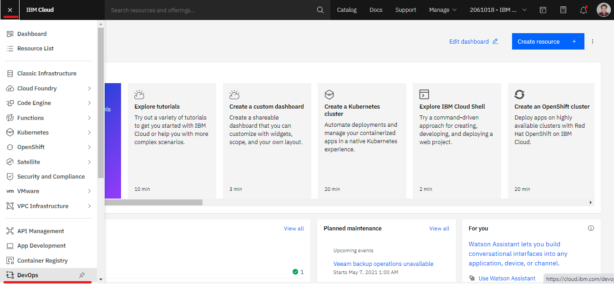

En la ventana de Toolchain, seleccionamos la ubicación que querramos, por ejemplo, Dallas o Londres, y le damos a *Crear Toolchain*:

  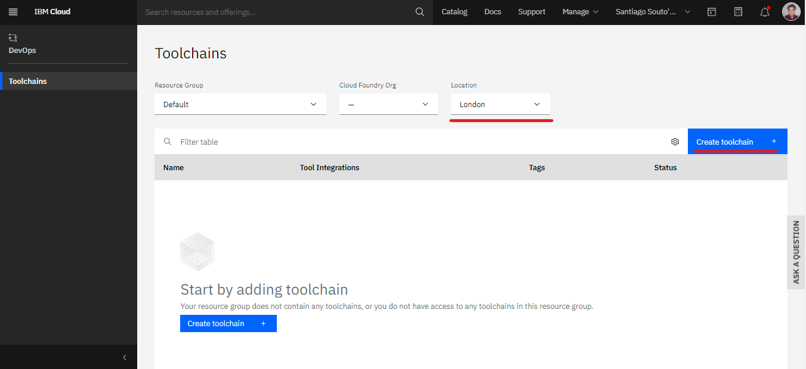

Una vez dentro, tenemos diferentes opciones de *toolchains* a partir de algunos templates, además, tenemos la opción de crear una desde cero. En esta ocasión, seleccionaremos el *template* de "*Develop a Kubernetes app*".

  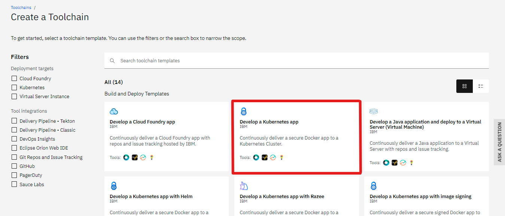

Ahora, podremos configurar todo lo necesario de nuestra *toolchain* para que pueda marcar todas las pautas de automatización del proceso de despliegue. Como vemos en la imagen, tenemos que escribirle un nombre a la *toolchain* e indicar el tipo de repostorio en donde tendremos el código fuente (Recordar que al ser desplegar un contenedor en Kubernetes, se deberá crear una imagen de Docker, por lo que junto con el código fuente, debemos tener, en el repositorio, un archivo Dockerfile):

  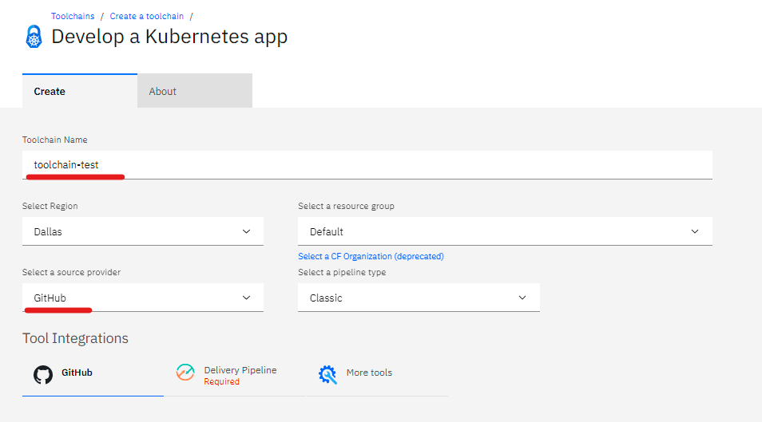

Si bajamos más en la misma ventana vemos la configuración del repositorio Git. Como el repositorio del que vamos a sacar el código no es nuestro, en el tipo de repositorio debemos poner *Clonar* para que nos cree un repositorio propio (con el nombre que especifiquemos en *Repository Name*), y clone el código de uno a otro. Luego, pondremos el URL de este repositorio ya que usaremos el código del lab 3 (https://github.com/IBMInnovationLabUY/pyxis-ocp):

  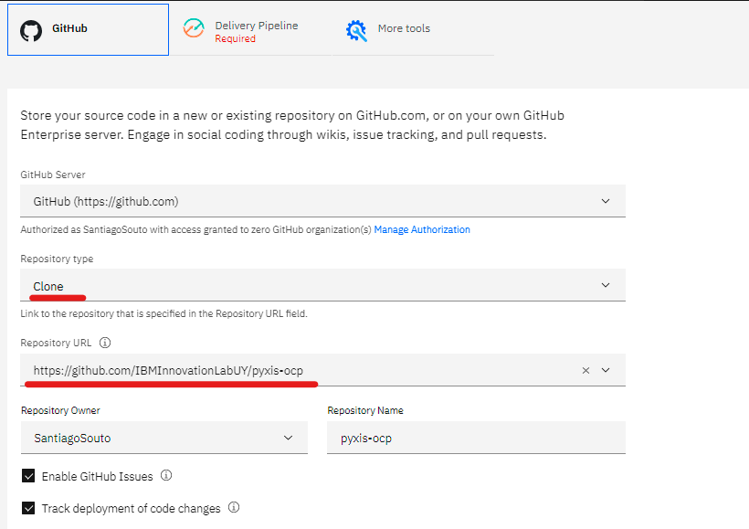

Luego, en la pestaña de *Delivery Pipeline* tenemos que crear una API key de IBM Cloud para poder acceder a los clusters y registries disponibles. Seleccionamos **New**:

  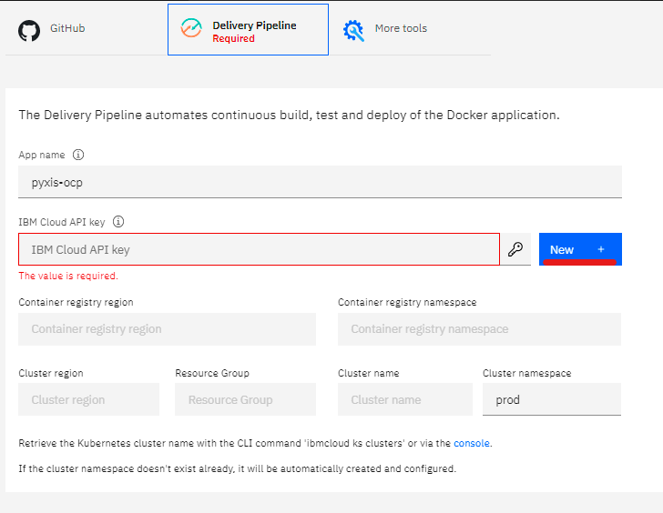

No es necesario, pero podemos cambiarle el nombre a esta nueva API key o agregarle una descripción, y luego al seleccionar **OK** se creará esta nueva API key y se colocará en el campo necesario de la configuración:

  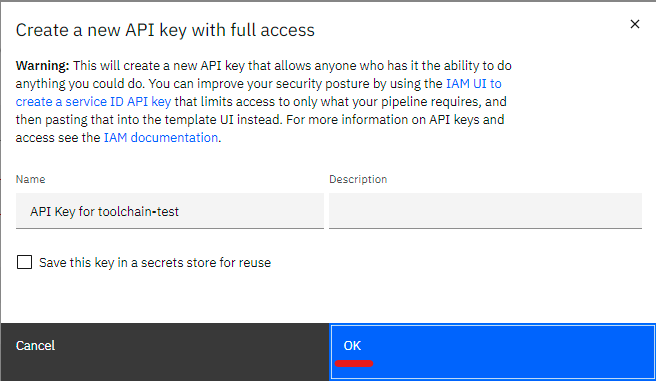

Automáticamente, se cargará tanto el COntainer REgistry que tengamos como los clusters disponibles (que pueden ser de Kubernetes u OpenShift), seleccionamos los que deseamos, en nuestro caso, vamos a asegurarnos de elegir el cluster de OpenShift, y en la parte de Cluster namespace, podemos elegir uno ya existente, o si escribimos un nombre de un proyecto que no existe, se creará en nuestro cluster, en este caso, vamos a dejar el nombre de **prod** y eso nos creará el proyecto *prod*. Una vez hecho todo esto, solo faltará crear la *toolchain*.

  

Una vez creado, podremos ver una página similar a esta. Vemos que hay una etapa tenemos configurado el repositorio de GitHub, y luego la zona de automatización, donde se realiza el proceso de tomar el código del repositorio, crear la imagen, y desplegarla en OpenShift.

  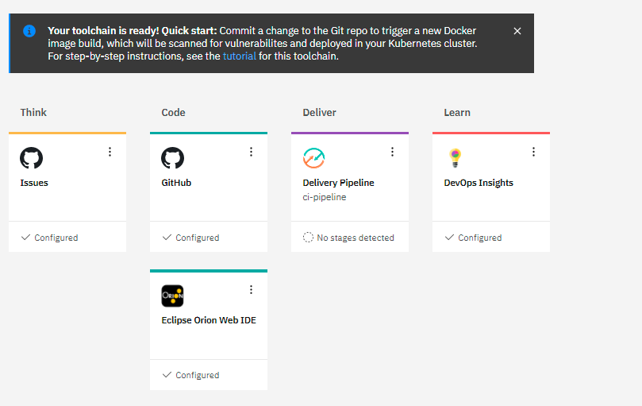

Antes de dejar la automatización, dentro de *Delivery Pipeline*, debemos cambiar la configuración de la primera stage, donde toma el código, ya que tenemos que decirle en que directorio buscarlo:

  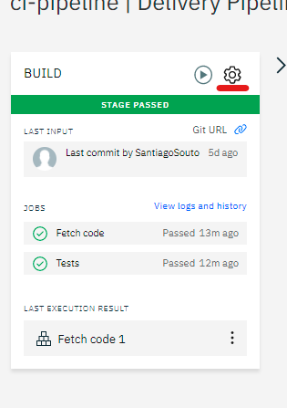

Como se mencionó, en la parte de *Working directory* debemos especificar **assets/lab3** que es donde está ubicado nuestro código dentro del repositorio:

  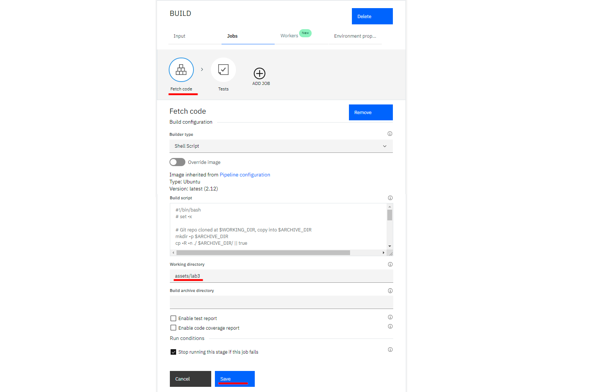

Una vez que reiniciamos el proceso veremos algo parecido a la imagen de abajo.

  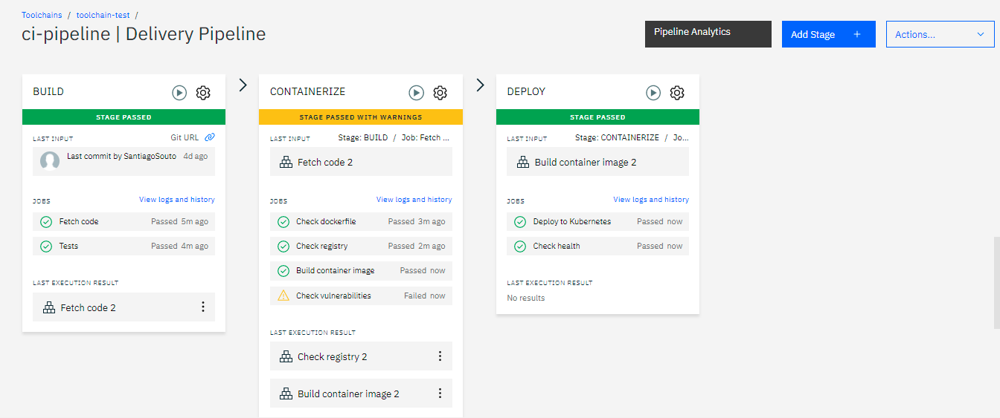

Lo que sucedió fue lo que venimos viendo, una *pipeline* toma el código del repositorio, otra toma ese código y, con un archivo de configuración (en este caso, un Dockerfile), crea y guarda una imagen en un registro y la conteneriza, y por último, en otra *pipeline*, se conecta con un servicio de Kubernetes, en este caso OpenShift, y la despliega en OpenShift.

Entonces, ahora podemos ir a nuestro cluster de OpenShift, abrir la consola web, buscar el proyecto ***prod*** y veremos nuestro despliegue con un servicio creado, en el caso de querer ver el mensaje en una URL, podremos crear una ruta que se asocie al servicio.

  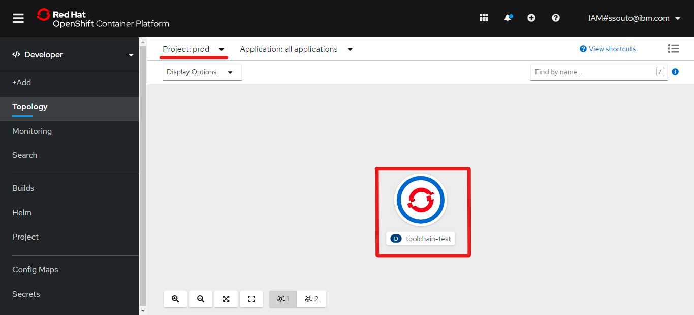

---

## TekTon en IBM Cloud Toolchain

TekTon es un **framework** open source de **CI/CD** (Integración Continua y Despliegue Continuo por sus siglas en inglés) flexible y nativo de Kubernetes que habilita la automatización de despliegues a través de múltiples plataformas.

TekTon define algunos recursos personalizados de Kubernetes como bloques para estandarizar el concepto de *pipeline* y brindar una terminología consistente con otras soluciones de **CI/CD**. Estos recursos son 4:
* **Task** : Algunos pasos, reusables, que realizan una tarea específica.
* **Pipeline** : La definición del *pipeline* y el **Task** que debe realizar.
* **TaskRun** : La ejecución y resultado de correr una instancia de un **Task**.
* **PipelineRun** : La ejecución y resultado de correr una instancia de un **Pipeline**, que incluye una cantidad de **TaskRuns**.

Con IBM Cloud Toolchain, tenemos la opción de crear una automatización muy parecida a la del lab anterior usando pipelines de TekTon, con Tasks preconfiguradas en vez de pipelines clásicas.

## Pongámoslo en práctica (Tekton)

### Para comenzara hacemos los mismos primeros pasos del lab anterior hasta la parte del catálogo de *templates* donde seleccionaremos *Develop a Kubernetes app* nuevamente...

Entonces, una vez en la ventana de configuración de la *toolchain* de Kubernetes, debemos seleccionar el repositorio del cual obtener nuestro código (en nuestro caso, GitHub), el nombre de nuestra *toolchain* y en la selección de **tipo de *pipeline*** elegiremos **TekTon** en vez de Classic.

  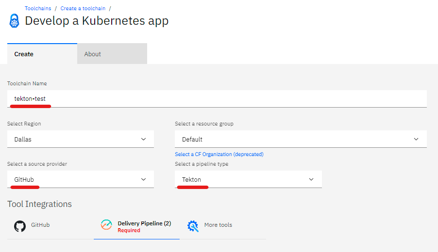

Al igual que el lab anterior, tenemos que indicar el URL del repositorio en el que se encuentra nuestro código fuente, y como en este caso no es un repositorio propio, le diremos que lo clone a un nuevo repositorio propio, en este caso, con el nombre de *pyxis-ocp-tekton*:

  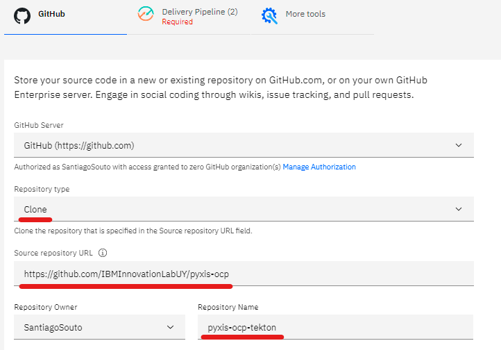

En la ventana de *Delivery Pipeline*, el principio es idéntico al lab anterior, debemos crear una nueva API key y al crearla se nos mostrara el cluster y registry donde trabajar:

  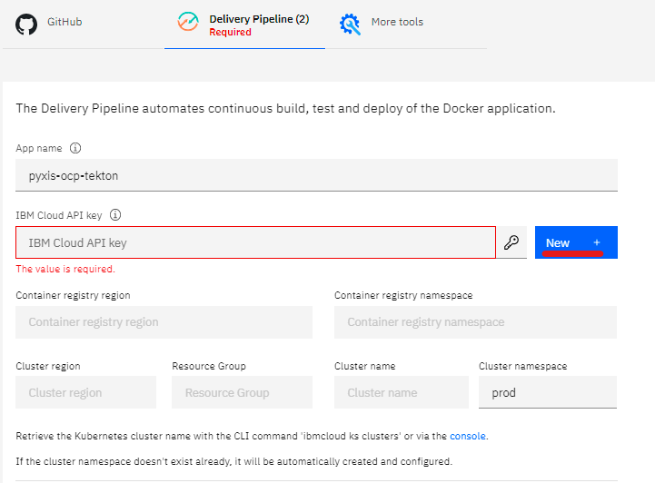
  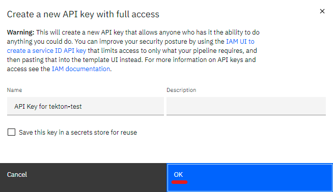
  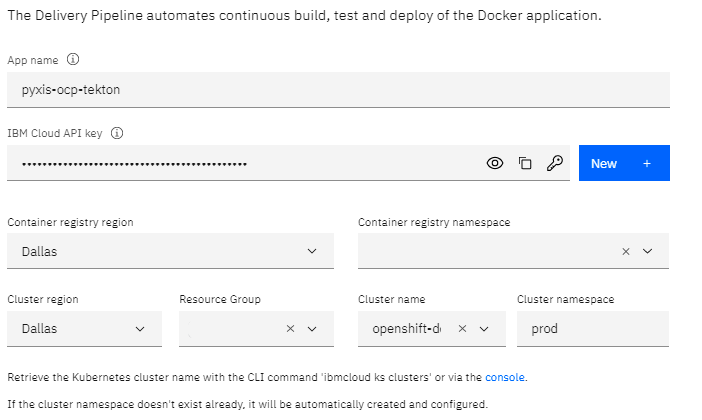

Estamos a punto de poder crear esta *toolchain* a base de pipelines de **TekTon**. Pero hasta ahora, comparado con el lab anterior, no se ha notado algún cambio en la configuración. Entonces, como vemos en la imagen, esta sección de *TekTon Definitions* que se encuentra abajo de la ventana de *Delivery Pipeline* nos muestra 2 "definiciones": **pipeline-repo** y **tekton-catalog-repo**. Estas 2 secciones tienen repositorios predeterminados donde están los archivos YAML que se usarán para crear las diferentes **Tasks** o **Pipelines** de TekTon para desplegar el código fuente del repositorio indicado previamente a un cluster de Kubernetes en un contenedor. Dicho esto, no será necesario cambiar los valores predeterminados de estas secciones, por lo que podemos *Crear* ya la *toolchain*:

  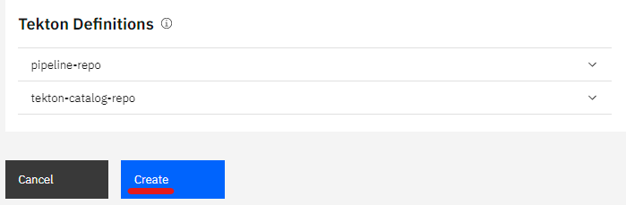

Una vez creado, veremos tres bloques de GitHub, uno donde estará nuestro código fuente, y los otros dos son los que tienen las configuraciones de Task y Pipeline de TekTon. Además, tenemos dos *Delivery Pipeline*, aunque nos concentraremos en el primero, ya que tendremos que cambiar, aquí también, la ruta donde encontrar el dockerfile junto con el código fuente y así poder crear la imagen para luego desplegarla en OpenShift.

  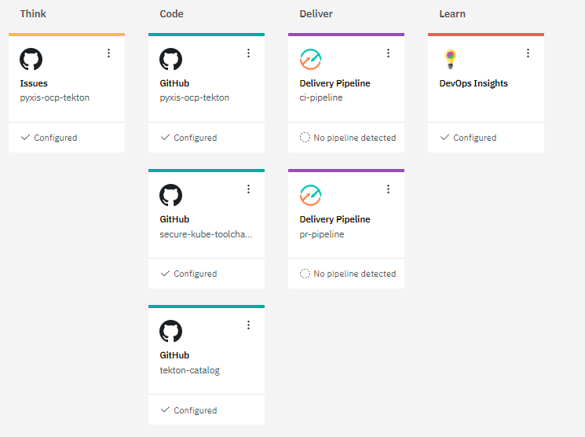

Entramos a la primer *Delivery Pipeline*, y vamos a ver que hay un **PipelineRun** ejecutandose, solo que esta primera vez va a dar un error, pues al buscar por el *Dockerfile* o el código fuente, por defecto, buscará en la raíz (*root*) del repositorio, es por ello, que debemos agregar dos variables de entorno al **Pipeline** que se llamarán *path-to-dockerfile* y *path-to-context* ya que esos son los nombres de las variables seteadas automáticamente por la **Pipeline**.

  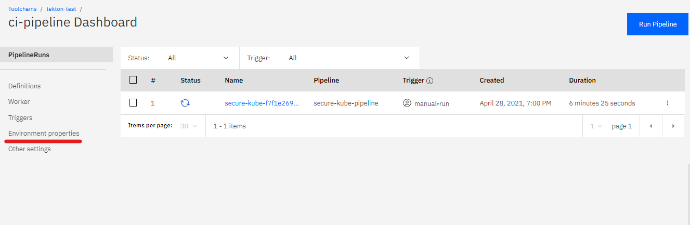

De esta manera, entramos a la ventana de *Environment properties* y vamos a agregar esas dos variables de entorno para que se sigan usando en cada próximo **PipelineRun**. Para ello, cliqueamos en **Add +**:

  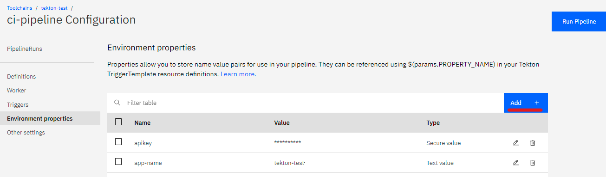

En ambos casos agregaremos un **Text Value** y en el *value* de ambos escribiremos ***assets/lab3*** (puede tener o no un / al final, el resultado no varía):

  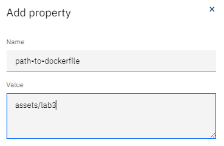
  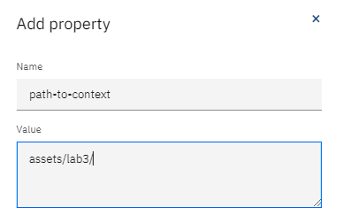

Con esto configurado, podemos, ahora si, volver a ejecutar el **Pipeline** cliqueando en *Run Pipeline*:

  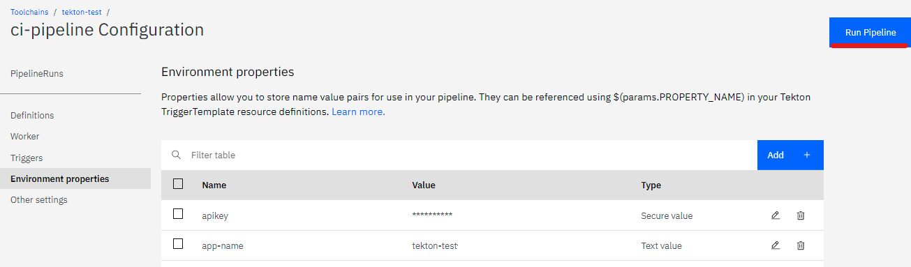

Una vez que termine de ejecutar todas las tareas, podremos ver que se completó correctamente, y solo faltaría verificarlo en nuestro cluster de OpenShift en el proyecto *prod*:

  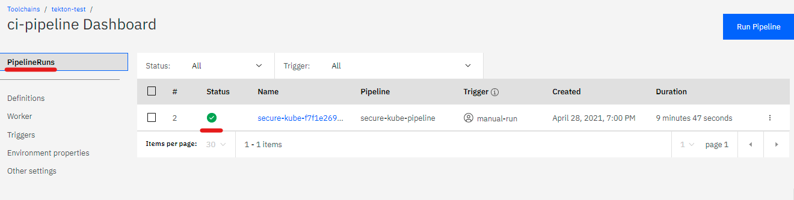

Por último, en la consola web de nuestro cluster, en el proyecto *prod*, debería aparecer este despliegue listo. En el caso de querer visualizarlo desde un URL, crearemos una ruta, que es la forma general en OpenShift para crear una ruta de un servicio.

  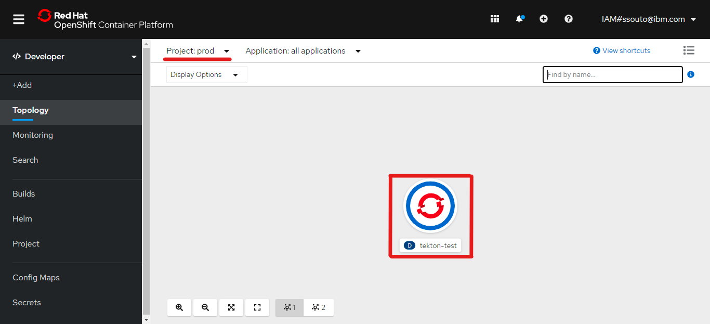

Ahora, para crear una ruta, es bastante simple, simplemente hay que ir al área de *Administrador*, luego a *Networking*, *Route* y *Create Route*. Una vez dentro, simplemente escribimos un nombre para nuestra ruta, elegimos el servicio ya creado y el puerto que expone. No es necesario escribir un *hostname* ya que creará el URL automáticamente. Solo queda cliquear *Crear* y veremos que aparece la opción de redirección de URL. ¡Y quedaría listo!

  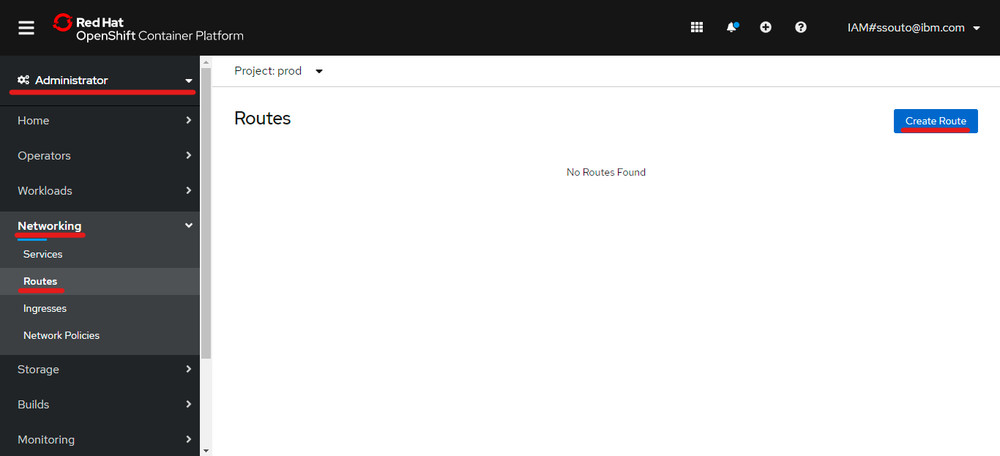
  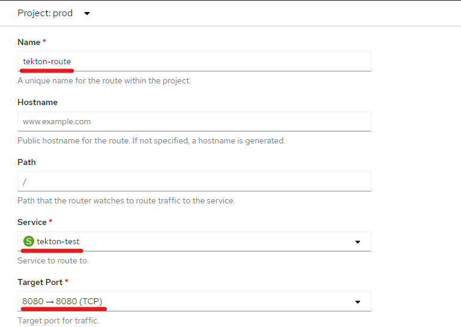
  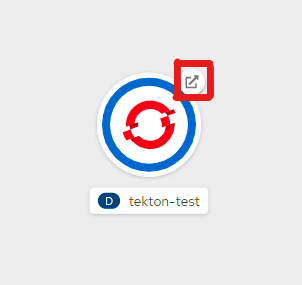
  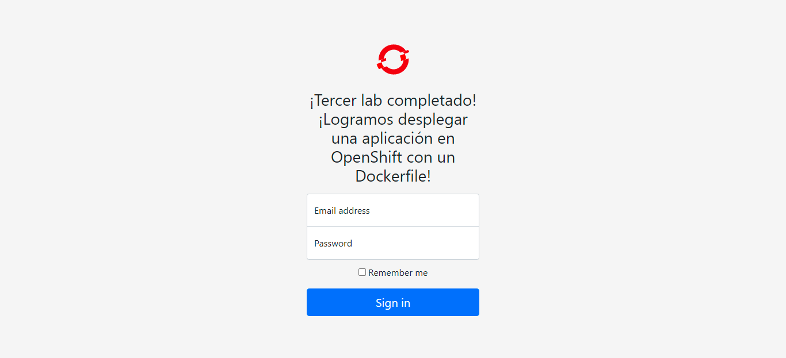

---

### Con esto finalizamos la sección de Devops, Toolchains & TekTon. Avancemos a la última sección... **Monitoring & Logging**

---

* [→ Siguiente Sección (Monitoring & Logging)](../3.4/monitoring-logging.md#monitoring-&-logging)

* [← Volver al índice](/README.md)