# Monitoring & Logging

---

* [← Volver al índice](/README.md)
---
  

## *Indice de la sección:*

* ## **Monitoring & Logging**
    
    * [IBM Cloud Monitoring con Sysdig](#ibm-cloud-monitoring-con-sysdig)
    * [IBM Cloud Log Analysis con LogDNA](#ibm-cloud-log-analysis-con-logdna)
    
---

### Cuando desplegamos imagenes en un cluster, por ejemplo, de OpenShift, pueden surgir errores tanto en tiempo de ejecución, o al consumir alguna aplicación, o desde el lado de producción. Para ello es importante tener una forma de visualizar estas alertas o problemas, poder monitorearlos y hasta ver sus logs de manera ordenada y limpia. Es por ello que IBM Cloud, junto con Sysdig y LogDNA como partners, brinda estos servicios para usarlos desde la nube.

## IBM Cloud Monitoring con Sysdig

IBM Cloud Monitoring con Sysdig es un servicio de monitoreo completamente administrado para ya sea administradores, equipos de DevOps o desarrolladores. Es un sistema de administración nativo de la nube, de terceros (*Sysdig*) que puede ser incluído como parte de la propia arquitectura de IBM Cloud. Ofrece la habilidad de monitorear problemas a través del stack completo que un sistema brinda, además de características de monitoreo y solucionador de problemas, definición de alertas o notificaciones y dashboards personalizados.

### Características y beneficios  de usar IBM Cloud Monitoring con Sysdig:

* **Acelerar el diagnóstico y solución de problemas de funcionamiento:** Presenta gran visibilidad hacia la infraestructura interna y las aplicaciones con la habilidad de solucionar problemas tanto a nivel de servicios como hasta el nivel del sistema. Sus dashboards predefinidos y alertas o notificaciones simplifican la identificacioón de potenciales amenazas o problemas.

* **Control de costos:** Incluye una funcionalidad que ayuda a controlar el costo de la infraestructura de monitoreo en la nube de IBM.

* **Explorar y visualizar el ambiente completo:** Se facilita observar y explorar visualmente el ambiente propio. Los *mapas de topología* dinámicos brindan una vista de las dependencias entre servicios. Además, se pueden personalizar los dashboards lo que también permite visualizar lo que más importa.

* **Obtener conocimientos críticos sobre Kubernetes y contenedores para el monitoreo dinámico de microservicios:** Descubre automáticamente ambientes de Kubernetes brindando dashboards y alertas *out of the box* para clústers, nodos, espacios de nombre, servicios, despliegues, pods, entre otros.

* **Mitigar el impacto de situaciones anormales con notificaciones proactivas:** Incluye alertas y notificaciones multicanal que se pueden usar para reducir el impacto de las operaciones del día a día y acelerar las reacciones y tiempo de respuesta ante anormalidades, tiempos de baja y degradaciones de funcionamiento.

### Veamos cómo acceder y conectar un servicio de monitoreo a un cluster desde IBM Cloud

Primero, desde la página principal de IBM Cloud, vayamos al clúster que queremos conectar y entremos al dashboard de dicho clúster, en nuestro caso, de OpenShift:

  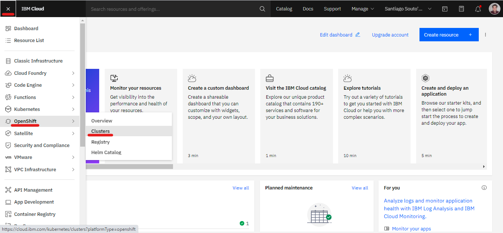

  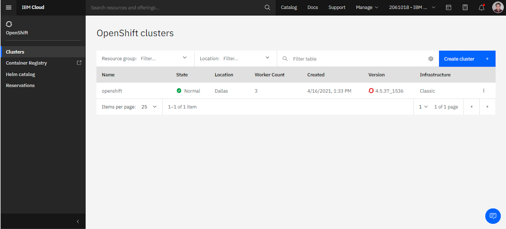

  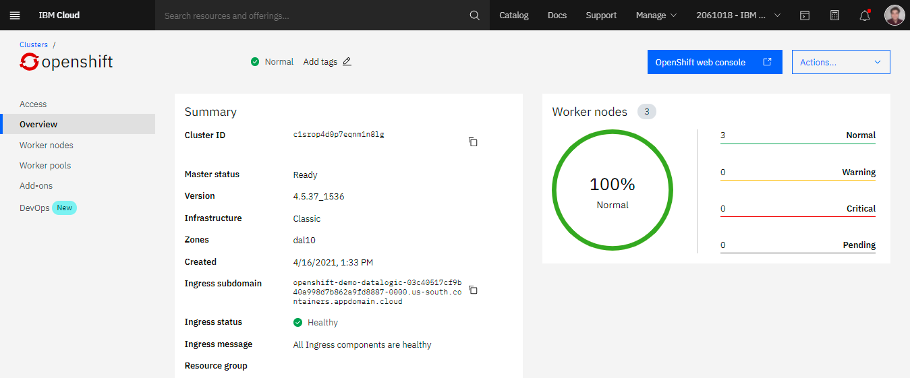

Más abajo veremos dos opciones con un botón en cada una para conectar un servicio de *Logging* y otro de *Monitoring*, esta vez elegiremos la segunda:

  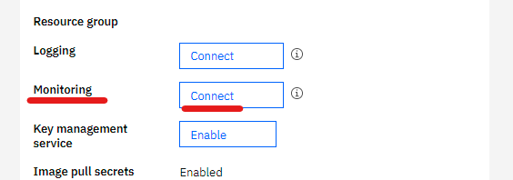

Si no tenemos un servicio existente, nos pedirá que creemos uno:

  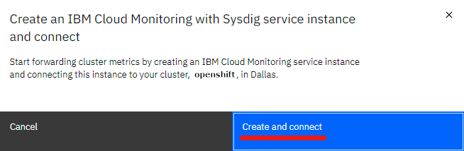

Por esta vez elegieremos el plan *Free*:

  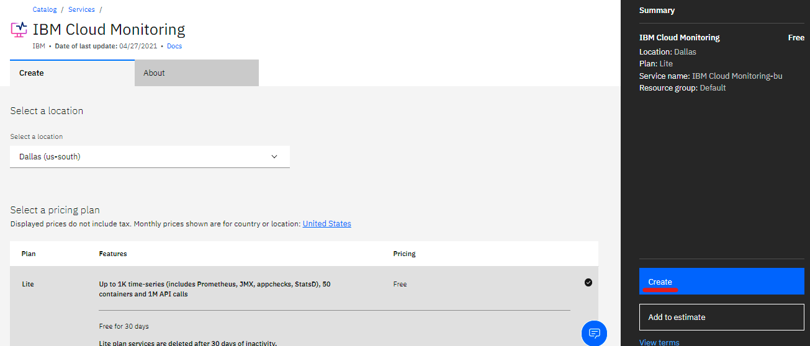

Ahora nos dan la opción de abrir el dashboard de monitoreo:

  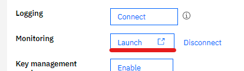

Este es un ejemplo de dashboard de un clúster usado:

  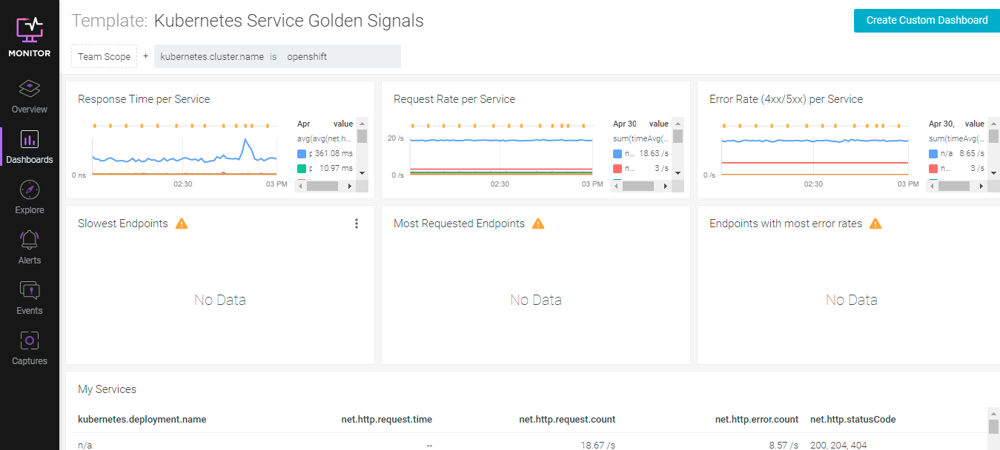

---

## IBM Cloud Log Analysis con LogDNA

IBM Log Analysis con LogDNA es usado para agregar capacidades de administración de logs a la arquitectura de la nube propia. Ofrece características avanzadas de filtrado, búsqueda y seguimiento de los datos de logs, define alertas y diseñavistas personalizadas para monitorear aplicaciones y logs del sistema.

Algunas características son:

* Logs para solucionar problemas en tiempo real.
* Alertas personalizadas.
* Posibilidad de exportar logs en formato JSON.
* Controlar costos de lo infraestructura de logging.

### Veamos cómo acceder y conectar un servicio de logging a un cluster desde IBM Cloud

Estando ya en el dashboard de nuestro clúster de OpenShift, luego de conectar el servicio de monitoreo:

  

Ahora veremos que de esas dos opciones con un botón en cada una podemos conectar un servicio de *Logging* y abrir un servicio previemente conectado de *Monitoring*, esta vez seleccionamos conectarnos a un servicio de *Logging*:

  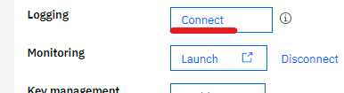

Si no tenemos un servicio existente, nos pedirá que creemos uno:

  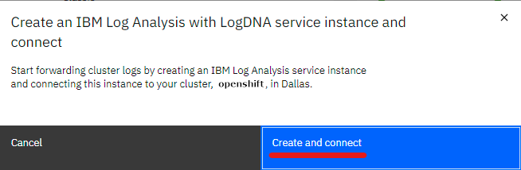

Por esta vez elegieremos el plan *Free*:

  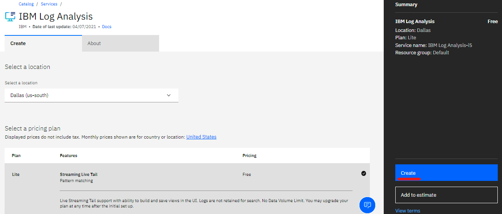

Ahora nos dan la opción de abrir el dashboard de logging:

  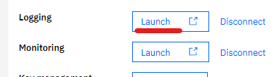

Esta será el dashboard de donde poder ver y filtrar los logs:

  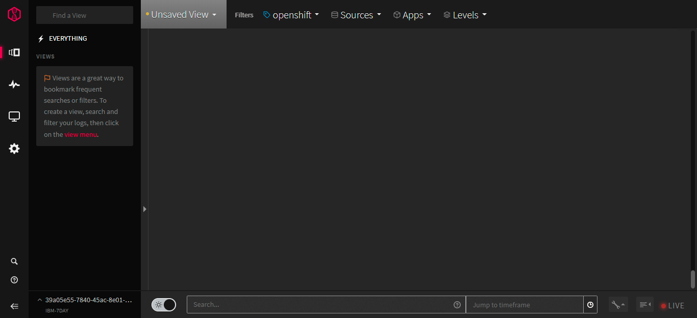

---

### Con esto finalizamos la sección de Monitoring & Logging y la lección de OpenShift. Avancemos a la siguiente lección... **Satellite**

---

* [→ Siguiente Lección (Satellite)](../../4/satellite.md#satellite)

* [← Volver al índice](/README.md)