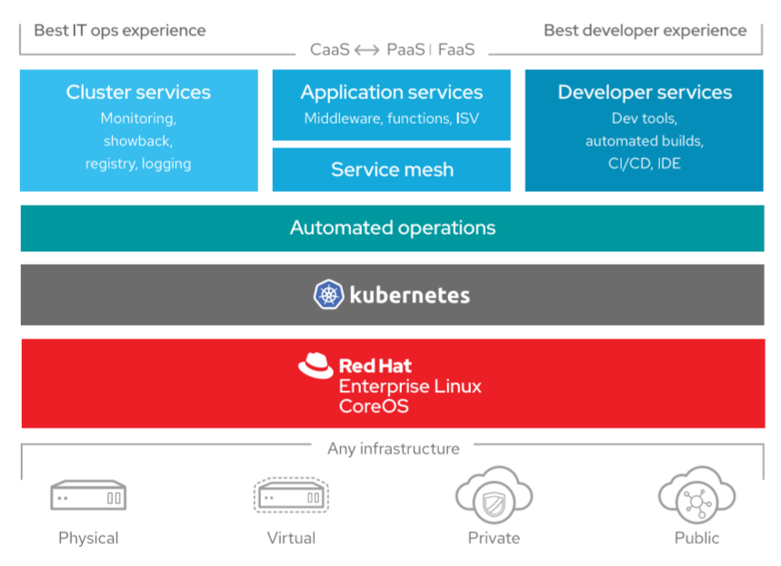
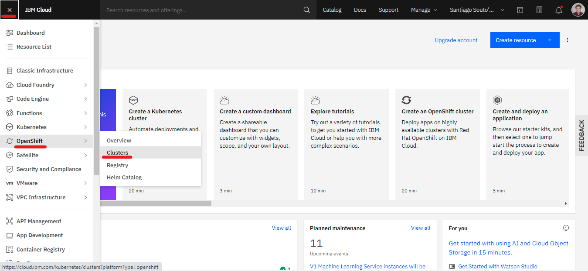
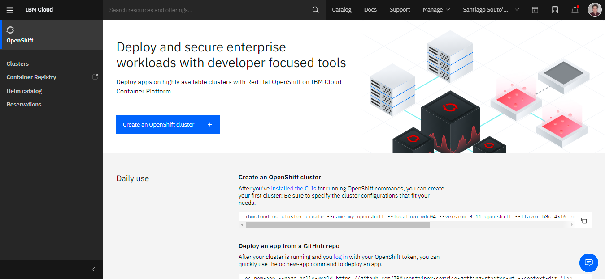
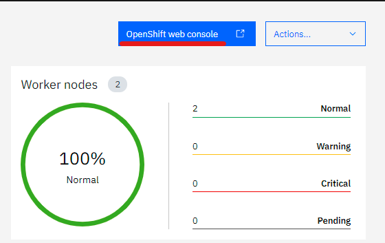

# Introducción a OpenShift

---

* [← Volver al índice](/README.md#indice)
---
  

## *Indice de la sección:*

* ## **Introducción a OpenShift**
    
    * [Red Hat OpenShift Kubernetes Service (ROKS)](#red-hat-openshift-kubernetes-service-(roks))
    * [Red Hat Openshift en IBM Cloud](#red-hat-openshift-en-ibm-cloud)
      * [Contenedores y Kubernetes](#contenedores-y-kubernetes)
      * [Red Hat OpenShift Service](#red-hat-openshift-service)
      * [¿En qué nos podemos beneficiar al usar Red Hat OpenShift?](#¿en-qué-nos-podemos-beneficiar-al-usar-red-hat-openshift)
      * [Infraestructura de Red Hat OpenShift Kubernetes Service (ROKS)](#infraestructura-de-red-hat-openshift-kubernetes-service-(roks))
    * [Instalar la CLI de Red Hat OpenShift para trabajar desde la terminal](#instalar-la-cli-de-red-hat-openshift-para-trabajar-desde-la-terminal)
    * [Crear un cluster y entrar al dashboard](#crear-un-cluster-y-entrar-al-dashboard)
    

---

## Red Hat OpenShift Kubernetes Service (ROKS)

Red Hat Openshift Kubernetes Service es una plataforma de nube híbrida (*Hybrid Cloud*) para aplicaciones empresariales en Kubernetes siendo así, una extensión de Kubernetes. Con el propósito de brindar una plataforma más integral, se basa en construir (*build*) en Kubernetes.

El desarrollo nativo de la nube requiere automatización, una de las muchas cualidades que provee *ROKS*. Con esto nos referimos a que trabajando con esta plataforma, tenemos la posibilidad de automatizar la construicción (*building*), testeo (*testing*) y unión (*merging*) de nuevos cambios en el código fuente de nuestras aplicaciones.

Además, nos ofrece diferentes formas de desplegar nuestros contenedores e imagenes, según nuestras preferencias o necesidades (*lo veremos en más detalle en la próxima sección*).

---

## Red Hat Openshift en IBM Cloud

Muy bien... vamos a recapitular todo lo que hemos visto hasta ahora, pues ha sido todo a modo de introducción para este tema. Hemos hablado de contenedores, de Kubernetes, de Container Registry, cómo todo se relaciona con IBM Cloud. Ahora comenzaremos a hacer un mini repaso para empezar a entender cómo funciona y cómo podemos usar el servicio de Red Hat Openshift que provee IBM Cloud como servicio de multi-nube híbrida (*hybrid multicloud*) como una verdadera solución a nivel empresarial abierta y altamente escalable.

### Contenedores y Kubernetes

Los contenedores nos aseguran portabilidad de aplicaciones a través de diferentes ambientes en la *hybrid cloud* y permite que los desarrolladores únicamente se enfoquen en construir un gran producto, sin la distracción de revisar la infrastructura interna o detalles de ejecución.

Por otra parte, administrar despliegues de contenedores presenta un nuevo desafío para los equipos de operación informática. Es por ello que hoy en día es muy común trasladarse a **Kubernetes** y su gran variedad de características complejas que nos ayudan a orquestrar y administrar contenedores durante ambientes de *producción*, *desarrollo* y *testeo*.

Kubernetes es una capa de orquestación que permite a los contenedores individuales interpolarse y brindar la funcionalidad deseado del conjunto de contenedores, como una aplicación única. Automáticamente escala contenedores, reinicia a los que fallan, manteniendo la aplicación funcionando a través de diferentes infraestructuras.

### Red Hat Openshift Service

Red Hat Openshift tiene todo lo necesario para *hybrid cloud*, contenedores a nivel empresarial y desarrollo y despliegue de Kubernetes. Incluye uno de los sistemas operativos de Linux más implementados en la nube pública (*public cloud*), **Red Hat Enterprise Linux**, además de soluciones de tiempo de ejecución de contenedores (*container runtime*), *networking*, monitoreo (*lo veremos en una sección próxima*), *container registry* interno, autenticación y autorización.

### ¿En qué nos podemos beneficiar al usar Red Hat OpenShift?

* Red Hat OpenShift provee una plataforma de Kubernetes confiable.
* Esta plataforma confiable también brinda una capa consistente sobre todos los entornos de nube, habilitando a desarrolladores y equipos de operación a trabajar juntos sin problemas.
* Además, admite una amplia gama de aplicaciones por lo que los desarrolladores pueden ser más productivos al momento de construir aplicaciones en Red Hat OpenShift.
* Funciona como un servicio de código abierto (*open source*).

### Infraestructura de Red Hat OpenShift Kubernetes Service (ROKS)

Como vemos en la imagen, *ROKS* se compone de el sistema operativo Linux *Enterprise Linux CoreOS*, luego tenemos la capa de Kubernetes, las operaciones automatizadas (*que las veremos en una sección próxima*) y luego, las diferentes soluciones o características que ofrece:

  

---

## Instalar la CLI de Red Hat OpenShift para trabajar desde la terminal

Si bien, nosotros veremos principalmente como usar **ROKS** por medio del *dashboard* en la web, es importante saber que podremos hacer todo eso desde la terminal instalando el CLI de OpenShift. <a href="https://cloud.ibm.com/docs/openshift?topic=openshift-openshift-cli">Haga click aquí</a> para ser redirigido a la documentación de IBM Cloud para instalarlo.

---

## Crear un cluster y entrar al dashboard

Vamos a crear un cluster de OpenShift desde IBM Cloud:

Lo primero que debemos hacer es entrar con nuestra cuenta a [IBM Cloud](https://cloud.ibm.com) y abrir la barra lateral izquierda, en la parte de *OpenShift* - *Clusters*:

  

Luego, cliqueamos en *Crear un cluster de OpenShift +*:

  

Luego elegimos el plan que mejor se ajuste a nuestras necesidades y lo podremos ver en la misma sección donde presionamos para crearlo (*imagen anterior*)

Una vez creado, entramos al cluster, y para abrir el *dashboard* de OpenShift (*web console*) cliqueamos en *Consola web de OpenShift*:

  

Y listo, debería abrirnos una nueva ventana con la consola web de OpenShift lista para trabajar:

  

---

### Con esto finalizamos la sección introductoria de OpenShift. Avancemos a la siguiente sección... **Desplegar imagenes**

---

* [→ Siguiente Sección (Desplegar imagenes)](3.2/desplegar_imagenes.md#desplegar-imagenes)

* [← Volver al índice](/README.md#indice)